<div align="center">

# 🎼 B A L L A D E
### *A Symphonic Wayland Desktop Shell for Hyprland*

[](https://hyprland.org/)
[](https://quickshell.outfoxxed.me/)
[](https://www.qt.io/)
[](https://m3.material.io/)
[](LICENSE)

<br/>

> **"A desktop should not just be a tool; it should be an atmosphere."**  
> *Ballade blends the ethereal frosted-glass minimalism of classic Linux ricing with an intelligent, modular ecosystem designed for fluid everyday focus.*

<br/>

---

### 🌟 Visual Showcase

| 🌲 Forest Green Serenity | 🔮 Amethyst Nocturne |
| :---: | :---: |
|  |  |

| 🌌 3D Panoramic Wallpaper Carousel | 🌸 Sakura Ambient Workspace |
| :---: | :---: |
|  |  |

| 🎵 Acoustic Control & Synced Lyrics | ⚙️ Unified Presets & Settings Hub |
| :---: | :---: |
|  |  |

---

</div>

<br/>

## 🧭 Navigation
- 📖 [Design Philosophy & Lineage](#-design-philosophy--lineage)
- ⚡ [60-Second Quick Start](#-60-second-quick-start)
- 🎛️ [Core Experiences & Capabilities](#️-core-experiences--capabilities)
- 🎨 [Dynamic Theming & Handcrafted Presets](#-dynamic-theming--handcrafted-presets)
- ⌨️ [IPC & Keybinding Shortcuts](#️-ipc--keybinding-shortcuts)
- 🏗️ [Under the Hood: Architecture](#️-under-the-hood-architecture)
- 📦 [System Prerequisites](#-system-prerequisites)
- 📂 [Directory Anatomy](#-directory-anatomy)
- 💖 [Lineage & Acknowledgements](#-lineage--acknowledgements)

---

## 📖 Design Philosophy & Lineage

Most desktop environments force a choice between **barebones minimalism** and **cluttered feature suites**. **Ballade** was forged to eliminate that compromise.

```
       [ end-4 / dots-hyprland ]                 [ pctrade / end4-pC ]
     (Illogical Impulse Aesthetic)              (Modular AI & Panel Power)
                   │                                         │
                   └────────────────────┬────────────────────┘
                                        ▼
                                 ╔══════════════╗
                                 ║   BALLADE    ║
                                 ╚══════════════╝
                                        ▲
                                        │
                         [ Personal Refinements & Overhauls ]
                         • 3D Panoramic Cover-Flow Carousel
                         • Fluid Tactile Music Controls
                         • Harmonized 16-Color ANSI Palettes
                         • Multi-Language Synced Lyrics
                         • Self-Resolving Portability
```

### The Three Pillars of Ballade:
1. **The Glass & Geometry of `ii` ([end-4/dots-hyprland](https://github.com/end-4/dots-hyprland))**:  
   Honoring the iconic frosted-glass blur, non-intrusive status geometry, and disciplined visual typography of the original Illogical Impulse.
2. **The Modular Intelligence of `end4-pC` ([pctrade/end4-pC](https://github.com/pctrade/end4-pC))**:  
   Integrating full-featured sidebars, multi-model AI companions, instant screen OCR translation, and desktop widgets into a single cohesive runtime.
3. **Personal Innovations (`valse-de-anshu`)**:  
   Overhauling the wallpaper picker into a true 3D panoramic carousel, engineering thicker ergonomic wavy audio progress sliders with circular handles, synchronizing master volume triggers with instant visual OSD feedback, curating 6 handcrafted ANSI terminal palettes, and automating standalone deployment.

---

## ⚡ 60-Second Quick Start

Ballade is fully standalone. It can coexist alongside any other shell configuration without touching your personal files.

### 1. Install Runtime Dependencies (Arch Linux / CachyOS)
```bash
sudo pacman -S --needed quickshell hyprland qt6-declarative qt6-5compat qt6-svg qt6-wayland \
    pipewire wireplumber playerctl canberra-gtk-play mpv jq wl-clipboard cliphist \
    tesseract tesseract-data-eng hyprpicker hyprsunset kitty
```

### 2. Clone into QuickShell Directory
```bash
git clone https://github.com/valse-de-anshu/Ballade.git ~/.config/quickshell/ballade
```

### 3. Initialize & Launch
```bash
cd ~/.config/quickshell/ballade
./setup.sh
qs -c ballade
```

### 4. Auto-Start with Hyprland
- **Using `dots-hyprland` (`~/.config/hypr/custom/env.lua`):**
  ```lua
  hl.env("qsConfig", "ballade")
  ```
- **Using standard `hyprland.conf`:**
  ```ini
  exec-once = qs -c ballade
  ```

---

## 🎛️ Core Experiences & Capabilities

### 🌲 1. Ambient Top Bar
* **Living Workspaces**: Smooth morphing dot indicators track active, occupied, and empty virtual desktops across multiple monitors with zero latency.
* **Audio Waveform Visualizer**: Live audio wave animation reflects system sound output in real-time. Left-click to inspect track preview; right-click to play/pause.
* **Jitter-Free Telemetry**: CPU %, RAM %, Swap %, and Temp meters utilize OpenType tabular figures (`tnum`) to eliminate number twitching. Swap auto-hides when unused (`0%`).
* **Interactive Tray & Calendar**: Context-aware status notifier tray, live weather forecast pill, and click-to-open calendar with world clock timezones.

### 🧠 2. Intelligent Left Sidebar
* **Conversational AI Companion**: Built-in support for Google Gemini API, local Ollama models (`llama3`, `deepseek`), and OpenAI ChatGPT with Markdown rendering and syntax-highlighted code blocks.
* **Live Side-by-Side Translator**: Instant multi-language translation (Google / DeepL) with auto-detection, character metrics, quick-copy actions, and a sleek modal language picker (`SelectionDialog.qml`).
* **Acoustic Player & Synced Lyrics**: Seekable wavy progress slider with an ergonomic circular handle head, track cover preview, and real-time timed subtitle streaming for English, Hindi, and YouTube tracks.
* **Booru Art Explorer**: Browse anime art and wallpaper boards with tag search and a 1-click "Apply as Wallpaper" shortcut.

### 🎚️ 3. Tactile Right Sidebar (Control Center)
* **Quick-Toggle Tiles**: 1-click toggles for Wi-Fi, Bluetooth, Night Light (Gamma temperature), Anti-Flashbang shader, Audio Sink Router, and Pomodoro Timer.
* **Master QuickSliders**: Smooth touch- and mouse-friendly sliders for Master Volume, Microphone Input Gain, and Display Brightness.
* **Live Audio Router**: Expandable output selector to redirect playback between Headphones, Speakers, Bluetooth headsets, and HDMI outputs on the fly.
* **Notification History Center**: Grouped notifications with actionable buttons, timestamps, and one-click clear.

### 🌌 4. 3D Panoramic Cover-Flow Carousel
* Displays every wallpaper in the active preset directory across the screen in an uninterrupted panoramic arc.
* Smooth zoom-on-hover with keyboard arrow navigation and instant Material You color extraction.

### 🖥️ 5. Desktop Home Widgets
* **Frosted Desktop Music Player**: Floating music card with wavy progress tracks and playback controls.
* **World Telemetry & Clocks**: Live weather telemetry from `wttr.in`, geographic dot-map locator projection, and customizable digital, analog, and pixel clocks.
* **Persistent Desktop Notes & Tasks**: Auto-saving sticky notes and to-do checklists.

---

## 🎨 Dynamic Theming & Handcrafted Presets

Ballade features a dual-tier color engine: **Material Design 3 extraction** from wallpapers, plus **6 handcrafted cohesive theme presets**:

| Preset | Accent Hue | Command Palette | Philosophy |
| :--- | :--- | :--- | :--- |
| **`green`** | `#4CAF50` | Forest Sage / Olive | Atelier Estuary calm, natural focus |
| **`purple`**| `#9C27B0` | Amethyst Violet / Lavender | Cyberpunk midnight with glowing accents |
| **`pink`**  | `#E05688` | Deep Rose / Pastel Orchid | Sakura vibrant anime aesthetic |
| **`red`**   | `#D32F2F` | Scarlet / Salmon Rose | High-energy crimson with pure error alerts |
| **`blue`**  | `#2196F3` | Cyan / Midnight Navy | Tokyo Night deep ocean tranquility |
| **`grayscale`** | `#78909C` | Nord Slate / Charcoal | Distraction-free monochrome productivity |

> **Unified Application Sync:** Changing a preset or wallpaper instantly updates QuickShell UI, Kitty (`current-theme.conf`), Konsole (`Quickshell.colorscheme`), KDE Plasma apps (Dolphin, Kate), GTK icons, and Starship prompt simultaneously.

---

## ⌨️ IPC & Keybinding Shortcuts

Control shell modules from Hyprland keybindings or terminal scripts:

```bash
qs -c ballade ipc call sidebarLeft toggle        # Left Sidebar (AI, Translator, Music)
qs -c ballade ipc call sidebarRight toggle       # Right Sidebar (Control Center, Sliders)
qs -c ballade ipc call overview toggle           # App Launcher & Window Overview
qs -c ballade ipc call wallpaperSelector toggle  # 3D Panoramic Wallpaper Carousel
qs -c ballade ipc call mediaControls toggle      # Music Player Popup & Seek
qs -c ballade ipc call sessionScreen toggle      # Power & Session Menu (Lock/Shutdown)
qs -c ballade ipc call osdVolume trigger         # Volume On-Screen Display HUD
qs -c ballade ipc call cheatsheet toggle         # Keybindings Cheatsheet
qs -c ballade ipc call cliphist toggle           # Clipboard History Manager
```

---

## 🏗️ Under the Hood: Architecture

```mermaid
graph TD
    subgraph Compositor ["Wayland Compositor (Hyprland)"]
        HL_IPC["Hyprland Socket IPC"]
        HL_ENV["~/.config/hypr/custom/env.lua (qsConfig = ballade)"]
        HL_RULES["~/.config/hypr/custom/rules.lua (Opacity & Blur)"]
    end

    subgraph CoreEngine ["QuickShell Shell Engine (ballade)"]
        ROOT["shell.qml"] --> ILLOGICAL["panelFamilies/IllogicalImpulseFamily.qml"]
        
        ILLOGICAL --> BAR["modules/ii/bar/ (Top Status Bar)"]
        ILLOGICAL --> SIDE_L["modules/ii/sidebarLeft/ (AI, Translator, Music)"]
        ILLOGICAL --> SIDE_R["modules/ii/sidebarRight/ (Control Center, Sliders)"]
        ILLOGICAL --> WALL["modules/ii/wallpaperSelector/ (3D Panoramic Picker)"]
        ILLOGICAL --> DESK["modules/ii/background/ (Desktop Music & Widgets)"]
        ILLOGICAL --> OVER["modules/ii/overview/ (App Launcher & Search)"]
        ILLOGICAL --> OSD["modules/ii/onScreenDisplay/ (HUD Overlays)"]
        ILLOGICAL --> SETT["modules/ii/settings/ (Settings Hub Overlay)"]

        SETT -->|Auto-Saves| CONFIG["modules/common/Config.qml"]
        CONFIG -->|JSON Adapter| STORE[("~/.config/illogical-impulse/config.json")]
    end

    subgraph Services ["Reactive Singletons (services/)"]
        AUDIO["Audio.qml (PipeWire Sound Engine)"]
        MPRIS["MprisController.qml (MPRIS Controller)"]
        WALL_SRV["Wallpapers.qml (Wallpaper Scanner)"]
        STATE["GlobalStates.qml (Navigation & Visibility)"]
    end

    HL_IPC --> BAR
    AUDIO --> OSD
    AUDIO --> SIDE_L
    MPRIS --> BAR
    MPRIS --> DESK
    WALL_SRV --> WALL
```



---

## 📦 System Prerequisites

| Domain | Required Packages | Purpose |
| :--- | :--- | :--- |
| **Compositor** | `hyprland`, `quickshell`, `qt6-declarative`, `qt6-5compat`, `qt6-svg` | Wayland compositing and QML rendering |
| **Audio Server** | `pipewire`, `wireplumber`, `playerctl`, `canberra-gtk-play`, `mpv` | Sound routing, MPRIS media control, audio events |
| **Theming Engine** | `matugen`, `kitty`, `konsole`, `plasma-apply-colorscheme` | Material Design 3 extraction and terminal syncing |
| **Utilities & OCR** | `jq`, `wl-clipboard`, `cliphist`, `tesseract`, `hyprpicker`, `hyprsunset` | Clipboard caching, OCR screen translation, gamma |

---

## 📂 Directory Anatomy

```text
ballade/
├── assets/                  # High-res icons, bundled sound effects (USB, power), and screenshots
├── modules/
│   ├── common/              # Shared components (MaterialShape, StyledSlider, SelectionDialog, Config)
│   ├── ii/                  # Illogical Impulse UI panels (bar, sidebars, overview, settings, wallpapers)
│   └── waffle/              # Alternative panel components
├── panelFamilies/           # Panel family definitions (IllogicalImpulseFamily.qml)
├── scripts/
│   ├── colors/              # switchwall.sh, applycolor.sh, generate_colors_material.py
│   ├── theming/             # apply-theme-preset.sh and handcrafted kitty-themes/
│   ├── kvantum/             # Material Kvantum / Qt widget theme generators
│   ├── lyrics/              # Real-time multi-language synchronized lyrics engine
│   └── play-usb-audio.sh    # Low-latency USB hardware event player
├── services/                # Reactive singletons (Audio.qml, MprisController.qml, Wallpapers.qml)
├── translations/            # Localization dictionary files (en_US, zh_CN, etc.)
├── GlobalStates.qml         # Central state manager for modal visibility
├── setup.sh                 # 1-Click environment initializer & permissions setup
└── shell.qml                # Root entrypoint
```

---

## 💖 Lineage & Acknowledgements

Ballade stands on the shoulders of giants in the Linux Wayland community:

- **[end-4](https://github.com/end-4)**: Creator of **[dots-hyprland (Illogical Impulse)](https://github.com/end-4/dots-hyprland)** — the aesthetic soul, frosted glass design, and structural foundation.
- **[pctrade](https://github.com/pctrade)**: Creator of **[end4-pC](https://github.com/pctrade/end4-pC)** — the modular expansion engine that brought AI, sidebars, and desktop widgets to life.
- **[Outfoxxed](https://github.com/outfoxxed)**: Creator of **[QuickShell](https://quickshell.outfoxxed.me/)** — the groundbreaking Qt6/QML desktop shell framework for Wayland.
- **[Vaxry](https://github.com/vaxerski)** & the **[Hyprland Team](https://hyprland.org/)** — for creating the finest tiling compositor in Linux history.

---

<div align="center">

Crafted with passion by **[Anshu (valse-de-anshu)](https://github.com/valse-de-anshu)**  
*Elevate your desktop experience.*

</div>
