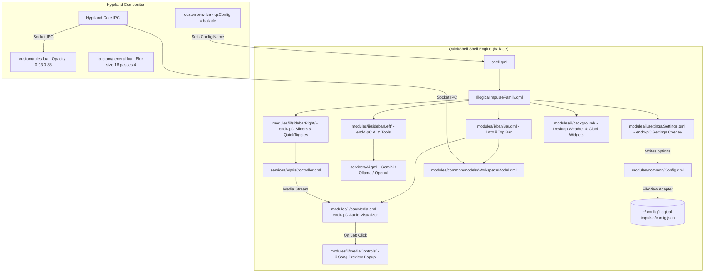

# 🎼 Ballade Rice: QuickShell Hybrid Configuration & Architectural Guide

## 🤖 Instructions for Future AI Agents
**READ THIS BEFORE MAKING ANY EDITS OR ATTEMPTING TO MODIFY QUICKSHELL / HYPRLAND CONFIGURATIONS.**

### Context & Primary Location
This repository, located at `/home/valse-de-anshu/.config/quickshell/ballade`, is a custom **hybrid rice** named **`ballade`**. It merges the best visual elements of **`ii` (IllogicalImpulse)** and the rich module ecosystem of **`end4-pC`**.

* **PRIMARY WORKING DIRECTORY DIRECTIVE**: All QuickShell modifications MUST be made in `/home/valse-de-anshu/.config/quickshell/ballade/`. Do NOT write code into `end4-pC` or `ii` directly.
* **HYPRLAND CUSTOM DIRECTORY**: Hyprland configuration overrides (blur strength, opacity, environment variables) MUST be written to `~/.config/hypr/custom/` (specifically `custom/env.lua`, `custom/rules.lua`, and `custom/general.lua`).
* **ENVIRONMENT BINDING**: QuickShell targets `ballade` via `hl.env("qsConfig", "ballade")` in `~/.config/hypr/custom/env.lua`.

### 🛡️ Protection Against `./setup` Script Wipes
The installer script `dots-hyprland/setup` executes `rsync -a --delete` on `~/.config/quickshell`, which would wipe untracked folders.
To prevent data loss, `/home/valse-de-anshu/Desktop/git hyprland dots/dots-hyprland/sdata/subcmd-install/3.files-legacy.sh` has been patched with:
```bash
install_dir__sync_exclude+=("ballade" "docs")
```
Additionally, `ballade` is fully initialized with its own local **Git repository** (`git init`) to track commits and restore states safely.

### 📝 Documentation Maintenance Directive
As an AI agent working on this repository, you are **REQUIRED** to keep this `README.md` file updated as you work:
1. **Git Commits:** Whenever you successfully implement a feature or fix a bug and commit it via `git`, you MUST update the `## 📦 Git Commit History & Statistics` section at the bottom of this document. Run `git log --oneline -n 15` and replace the code block with the latest log.
2. **Core File Glossary:** If you introduce a new major UI component, config file, logic module, or settings page, you MUST document it in the `## 📌 Important Section: Core File Glossary` at the bottom of this file. Use simple, generic terms (like "Settings UI", "Shape Engine") and explicitly describe its path, its purpose, and *when* a future agent should edit it.

---

## 💡 Code Logic & Architectural Insights (`ii` vs `end4-pC` vs `ballade`)

### 1. How `ii` (IllogicalImpulse) Worked
* **Top Bar**: Static bar layout (`modules/ii/bar/BarContent.qml`) containing fixed positions for workspace buttons, window title, music info text, clock, system tray, and utility icons.
* **Workspace Model**: Bound directly to `required property HyprlandMonitor monitor` in `WorkspaceModel.qml`.
* **Aesthetics**: Heavy reliance on **Frosted Glass Blur** with medium window opacities (`0.93` active / `0.88` inactive).
* **Limitations**: Lacked sidebars, desktop widgets, AI chat capabilities, and dynamic settings persistence.

### 2. How `end4-pC` Worked
* **Top Bar**: Fully dynamic bar powered by `BarWidgetSwitcher.qml` and `BarConfig.qml`, allowing users to drag and drop widgets between left, center, and right bar sections.
* **Workspace Model**: Multi-monitor model using `required property var screen` in `WorkspaceModel.qml`.
* **Sidebars & Overlays**: Introduced extensive feature panels (`sidebarLeft` with AI Chat, Translator, Booru; `sidebarRight` with QuickSliders, Volume Mixer, WiFi/Bluetooth dialogs) and a desktop Settings window (`modules/ii/settings/Settings.qml`).
* **Settings Engine**: Settings written to `Config.options` auto-saved via `FileView` JSON adapter directly to `~/.config/illogical-impulse/config.json`.
* **Aesthetics**: Complete transparency without heavy blur by default (disliked by the user).

### 3. How `ballade` Integrates Both (The Solution)
`ballade` combines the user's favorite aesthetics from `ii` with the powerful feature modules of `end4-pC`:

1. **Ditto `ii` Top Bar with `end4-pC` Visualizer**:
   * Restored the exact visual layout and styling of the **ditto `ii` top bar** (`modules/ii/bar/`).
   * Replaced `ii`'s static music title text with `end4-pC`'s animated **Audio Visualizer** ([`modules/ii/bar/Media.qml`](file:///home/valse-de-anshu/.config/quickshell/ballade/modules/ii/bar/Media.qml#L45)).
   * Left-clicking the visualizer toggles `GlobalStates.mediaControlsOpen`, opening `ii`'s native song preview & track control popup (`modules/ii/mediaControls/MediaControls.qml`).
2. **`end4-pC` Left & Right Sidebars**:
   * Integrated full `end4-pC` sidebars: `sidebarLeft` (AI Chat with Gemini/Ollama/OpenAI, Translator, Booru viewer) and `sidebarRight` (QuickSliders, Volume Mixer, WiFi/Bluetooth popups, Pomodoro timer).
3. **`end4-pC` Settings Overlay (`SUPER + Escape`)**:
   * Connected `Settings.qml` and `SettingsContent.qml` to `Config.qml` & `Directories.qml`, ensuring all 8 settings pages (Bar, General, Desktop, Interface, Services, Hyprland, Quick, Profile) write directly to `~/.config/illogical-impulse/config.json`.
4. **Frosted Glass Blur Restoration**:
   * Configured Hyprland window blur in `~/.config/hypr/custom/general.lua` (`size = 16`, `passes = 4`, `contrast = 1.0`, `vibrancy = 0.35`) and rules in `custom/rules.lua` (`opacity = "0.93 0.88"`).
5. **Launcher Overlap Fix**:
   * Disabled duplicate `fuzzel` fallback keybinds in `hyprland/keybinds.lua` so pressing `SUPER` only triggers the QuickShell launcher.

---

## 🛠️ Critical Bugs & Log Errors Resolved

During development and testing with `qs -c ballade`, several runtime QML errors were identified and resolved:

| Error / Warning | Location | Root Cause | Solution Applied |
| :--- | :--- | :--- | :--- |
| `Cannot assign to non-existent property "monitor"` | `WorkspaceModel.qml` | `ii` bar expected `monitor` property while `end4-pC` model expected `screen`. | Restored `ii`'s `WorkspaceModel.qml` with `monitor` binding. |
| `ReferenceError: filterDuplicatePlayers is not defined` | `SidebarRightContent.qml` | Function called in player list filter without being defined in component scope. | Added `filterDuplicatePlayers(players)` helper function with safe optional chaining. |
| `TypeError: Cannot read property 'enable' of undefined` | `NotificationPopup.qml` | Direct property access on `forceMonitor` before initialization. | Added optional chaining (`Config.options.notifications?.forceMonitor?.enable`). |
| `Cannot find member data` / Property override warning | `StyledSwitch.qml` & `Anime.qml` | Custom property `scale` clashed with QtQuick Item built-in `Item.scale`. | Renamed property to `switchScale`. |
| `Detected function onHostnameChanged in Connections element` | `Profile.qml` | Attempted to handle non-existent Qt signal `hostnameChanged`. | Removed invalid `Connections` block and bound property directly to `SystemInfo.hostname`. |
| `Unable to assign [undefined] to QQuickItem*` | `ToolbarTabBar.qml` | `contentItem.children[currentIndex]` evaluated to undefined during initial layout. | Added safe null fallback (`property Item targetItem: contentItem.children[root.currentIndex] ?? null`). |

---

## 🗺️ System Architecture of Ballade

The following diagram illustrates how QuickShell components, services, IPC socket listeners, and Hyprland rules interact inside `ballade`:



---

## 📦 Git Commit History & Statistics

The repository is version-controlled locally inside `/home/valse-de-anshu/.config/quickshell/ballade`. Below is the recent chronological commit history including the wallpaper picker architecture overhaul:

```text
5ebe9b8 (HEAD -> master) fix(bar): target /home disk partition, format hover popups, and fix layout jitter
a41254a refactor(bar): remove deprecated dynamic Divider settings
1e6a702 feat(wallpaper-selector): implement static Mac Dock style Cover Flow for panoramic mode
31bce2a fix(settings): remove redundant label to eliminate button overlap in Wall Shape section
b151a0a feat(wallpaperPicker): make wall shapes selectable in settings and remove top header bar
a3d75d2 feat(settings): add Wall Shape section with 5 shape and animation specifications
a06c1f3 feat(wallpaperPicker,widgets): integrate Cinematic Slanted picker, add 5 new shapes, and optimize widget performance
d52e1ee fix(media): fix seeking on desktop media widget wavy progress bar and enhance album art layout
11be865 style(media): widen desktop music player widget and convert album art to floating rounded square
72a732b fix(clipboard): fully protect pinned items from delete/wipe, persist pins across reboots by storing display text
64aa86c fix(clipboard): make wipe() atomic on 1st tap while preserving pinned items
43334d9 fix(clipboard): fix deleteEntry bug, add Pin/Unpin support and protect pinned items from wipe
019f47e feat(clipboard): add clear all clipboard history button (delete_sweep) to search bar header
c04e5ec fix(screenshot): strip trailing slash from savePath to fix double-slash in file path
1f8c4f9 fix(screenshot): use copy-image-with-path.py to show both image and file path in cliphist
```

---

## 📌 Important Section: Core File Glossary

If you ever need to revisit, modify, or debug the components of this rice, the following acts as an architectural map to the most frequently modified core files. 

### 1. The Wallpaper Picker UI (`HyprPickerContent.qml`)
**Path:** `modules/ii/wallpaperSelector/HyprPickerContent.qml`
**What it does:** This is the **Main UI file** for the wallpaper selector. It contains the visual layout logic, including the 3D "Cover Flow" geometry, the sliding "Mac Dock" scale animations, and the image loading logic. 
**When to edit:** Edit this if you want to change how the wallpaper cards look, adjust the 3D curvature, modify the gap sizes, or change the border highlighters.

### 2. The Settings Menu UI (`CustomWidgetsConfig.qml`)
**Path:** `modules/ii/settings/pages/CustomWidgetsConfig.qml`
**What it does:** This is the **Settings UI file** for the Custom Widgets page in the overlay menu. It contains the visual buttons, arrays, and text inputs (like the "Behavior" and "Card Shape" toggles) that the user interacts with.
**When to edit:** Edit this if you want to add new buttons, toggle switches, or shape options to the settings panel.

### 3. The Configuration Schema (`Config.qml`)
**Path:** `modules/common/Config.qml`
**What it does:** This is the **Master Configuration Schema**. It defines the JSON structure that QuickShell uses to save and load user preferences (e.g., `Config.options.wallpaperSelector.behavior`).
**When to edit:** Edit this **before** adding new toggles to the settings menu. If a property isn't defined here, the UI buttons won't react when tapped because the property won't emit a state-change signal.

### 4. The Geometry & Mask Engine (`MaterialShape.qml` & `material-shapes.js`)
**Path:** `modules/common/widgets/MaterialShape.qml` & `modules/common/widgets/shapes/material-shapes.js`
**What it does:** This acts as the **Shape Rendering Engine**. It uses QML `Canvas` and standard Qt transforms to draw complex geometric masks (like the `slanted` Cyberpunk parallelogram, `superellipse`, or `cookie`).
**When to edit:** Edit this if you want to create entirely new geometric borders or clip-masks for images and widgets across the rice.
