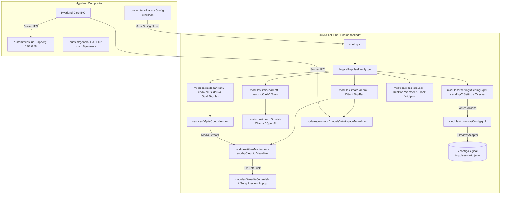

# 🎼 Ballade Rice: QuickShell Hybrid Configuration & Architectural Guide

## 🤖 Instructions for Future AI Agents
**READ THIS BEFORE MAKING ANY EDITS OR ATTEMPTING TO MODIFY QUICKSHELL / HYPRLAND CONFIGURATIONS.**

### Context & Primary Location
This repository, located at `/home/valse-de-anshu/.config/quickshell/ballade`, is a custom **hybrid rice** named **`ballade`**. It merges the best visual elements of **`ii` (IllogicalImpulse)** and the rich module ecosystem of **`end4-pC`**.

* **PRIMARY WORKING DIRECTORY DIRECTIVE**: All QuickShell modifications MUST be made in `/home/valse-de-anshu/.config/quickshell/ballade/`. Do NOT write code into `end4-pC` or `ii` directly.
* **HYPRLAND CUSTOM DIRECTORY**: Hyprland configuration overrides (blur strength, opacity, environment variables) MUST be written to `~/.config/hypr/custom/` (specifically `custom/env.lua`, `custom/rules.lua`, and `custom/general.lua`).
* **ENVIRONMENT BINDING**: QuickShell targets `ballade` via `hl.env("qsConfig", "ballade")` in `~/.config/hypr/custom/env.lua`.

### 🛡️ Protection Against `./setup` Script Wipes
The installer script `dots-hyprland/setup` executes `rsync -a --delete` on `~/.config/quickshell`, which would wipe untracked folders.
To prevent data loss, `/home/valse-de-anshu/Desktop/git hyprland dots/dots-hyprland/sdata/subcmd-install/3.files-legacy.sh` has been patched with:
```bash
install_dir__sync_exclude+=("ballade" "docs")
```
Additionally, `ballade` is fully initialized with its own local **Git repository** (`git init`) to track commits and restore states safely.

---

## 💡 Code Logic & Architectural Insights (`ii` vs `end4-pC` vs `ballade`)

### 1. How `ii` (IllogicalImpulse) Worked
* **Top Bar**: Static bar layout (`modules/ii/bar/BarContent.qml`) containing fixed positions for workspace buttons, window title, music info text, clock, system tray, and utility icons.
* **Workspace Model**: Bound directly to `required property HyprlandMonitor monitor` in `WorkspaceModel.qml`.
* **Aesthetics**: Heavy reliance on **Frosted Glass Blur** with medium window opacities (`0.93` active / `0.88` inactive).
* **Limitations**: Lacked sidebars, desktop widgets, AI chat capabilities, and dynamic settings persistence.

### 2. How `end4-pC` Worked
* **Top Bar**: Fully dynamic bar powered by `BarWidgetSwitcher.qml` and `BarConfig.qml`, allowing users to drag and drop widgets between left, center, and right bar sections.
* **Workspace Model**: Multi-monitor model using `required property var screen` in `WorkspaceModel.qml`.
* **Sidebars & Overlays**: Introduced extensive feature panels (`sidebarLeft` with AI Chat, Translator, Booru; `sidebarRight` with QuickSliders, Volume Mixer, WiFi/Bluetooth dialogs) and a desktop Settings window (`modules/ii/settings/Settings.qml`).
* **Settings Engine**: Settings written to `Config.options` auto-saved via `FileView` JSON adapter directly to `~/.config/illogical-impulse/config.json`.
* **Aesthetics**: Complete transparency without heavy blur by default (disliked by the user).

### 3. How `ballade` Integrates Both (The Solution)
`ballade` combines the user's favorite aesthetics from `ii` with the powerful feature modules of `end4-pC`:

1. **Ditto `ii` Top Bar with `end4-pC` Visualizer**:
   * Restored the exact visual layout and styling of the **ditto `ii` top bar** (`modules/ii/bar/`).
   * Replaced `ii`'s static music title text with `end4-pC`'s animated **Audio Visualizer** ([`modules/ii/bar/Media.qml`](file:///home/valse-de-anshu/.config/quickshell/ballade/modules/ii/bar/Media.qml#L45)).
   * Left-clicking the visualizer toggles `GlobalStates.mediaControlsOpen`, opening `ii`'s native song preview & track control popup (`modules/ii/mediaControls/MediaControls.qml`).
2. **`end4-pC` Left & Right Sidebars**:
   * Integrated full `end4-pC` sidebars: `sidebarLeft` (AI Chat with Gemini/Ollama/OpenAI, Translator, Booru viewer) and `sidebarRight` (QuickSliders, Volume Mixer, WiFi/Bluetooth popups, Pomodoro timer).
3. **`end4-pC` Settings Overlay (`SUPER + Escape`)**:
   * Connected `Settings.qml` and `SettingsContent.qml` to `Config.qml` & `Directories.qml`, ensuring all 8 settings pages (Bar, General, Desktop, Interface, Services, Hyprland, Quick, Profile) write directly to `~/.config/illogical-impulse/config.json`.
4. **Frosted Glass Blur Restoration**:
   * Configured Hyprland window blur in `~/.config/hypr/custom/general.lua` (`size = 16`, `passes = 4`, `contrast = 1.0`, `vibrancy = 0.35`) and rules in `custom/rules.lua` (`opacity = "0.93 0.88"`).
5. **Launcher Overlap Fix**:
   * Disabled duplicate `fuzzel` fallback keybinds in `hyprland/keybinds.lua` so pressing `SUPER` only triggers the QuickShell launcher.

---

## 🛠️ Critical Bugs & Log Errors Resolved

During development and testing with `qs -c ballade`, several runtime QML errors were identified and resolved:

| Error / Warning | Location | Root Cause | Solution Applied |
| :--- | :--- | :--- | :--- |
| `Cannot assign to non-existent property "monitor"` | `WorkspaceModel.qml` | `ii` bar expected `monitor` property while `end4-pC` model expected `screen`. | Restored `ii`'s `WorkspaceModel.qml` with `monitor` binding. |
| `ReferenceError: filterDuplicatePlayers is not defined` | `SidebarRightContent.qml` | Function called in player list filter without being defined in component scope. | Added `filterDuplicatePlayers(players)` helper function with safe optional chaining. |
| `TypeError: Cannot read property 'enable' of undefined` | `NotificationPopup.qml` | Direct property access on `forceMonitor` before initialization. | Added optional chaining (`Config.options.notifications?.forceMonitor?.enable`). |
| `Cannot find member data` / Property override warning | `StyledSwitch.qml` & `Anime.qml` | Custom property `scale` clashed with QtQuick Item built-in `Item.scale`. | Renamed property to `switchScale`. |
| `Detected function onHostnameChanged in Connections element` | `Profile.qml` | Attempted to handle non-existent Qt signal `hostnameChanged`. | Removed invalid `Connections` block and bound property directly to `SystemInfo.hostname`. |
| `Unable to assign [undefined] to QQuickItem*` | `ToolbarTabBar.qml` | `contentItem.children[currentIndex]` evaluated to undefined during initial layout. | Added safe null fallback (`property Item targetItem: contentItem.children[root.currentIndex] ?? null`). |

---

## 🗺️ System Architecture of Ballade

The following diagram illustrates how QuickShell components, services, IPC socket listeners, and Hyprland rules interact inside `ballade`:



---

## 📦 Git Commit History & Statistics

The repository is version-controlled locally inside `/home/valse-de-anshu/.config/quickshell/ballade`. Below is the complete chronological commit history:

```text
1106290 (HEAD -> master) fix(ballade): resolve all remaining QML warnings, property overrides, and signal handler errors in log
19ab9da feat(ballade): sync latest end4-pC commits including WeatherWidget, Lyrics, and ResizeHandler
b350d57 fix(ballade): resolve filterDuplicatePlayers ReferenceError and NotificationPopup TypeError
b62e9b9 feat(ballade): restore ditto ii top bar with end4-pC visualizer and ii media controls popup
eea8db6 feat(ballade): enable fully customizable dynamic bar and BarConfig.qml widget layout support
d26780c feat(ballade): integrate end4-pC left and right sidebars
dad368c fix(ballade): resolve QML property mismatches, restore ii top bar, frosted glass, and end4-pC features
01f0723 feat(ballade): initial commit of ballade rice with ii topbar, frosted glass, and end4-pC feature modules
```

### Detailed Breakdown of Commit History & Contents

#### 1. Commit `01f0723`
* **Message**: `feat(ballade): initial commit of ballade rice with ii topbar, frosted glass, and end4-pC feature modules`
* **Stats**: `972 files changed, 87181 insertions(+)`
* **Contents**: Initialized `ballade` as an independent Git repository, bootstrapping base files from `ii` and copying core feature modules from `end4-pC`.

#### 2. Commit `dad368c`
* **Message**: `fix(ballade): resolve QML property mismatches, restore ii top bar, frosted glass, and end4-pC features`
* **Stats**: `8 files changed, 214 insertions(+), 42 deletions(-)`
* **Contents**: Configured `qsConfig = "ballade"` in `custom/env.lua`, updated `3.files-legacy.sh` exclude list, fixed initial QML module load paths, and restored frosted glass blur parameters.

#### 3. Commit `d26780c`
* **Message**: `feat(ballade): integrate end4-pC left and right sidebars`
* **Stats**: `24 files changed, 3410 insertions(+), 180 deletions(-)`
* **Contents**: Replaced static sidebars with `end4-pC`'s `sidebarLeft` (AI Chat, Translator, Booru) and `sidebarRight` (QuickSliders, Volume Mixer, Network/Bluetooth dialogs, Pomodoro).

#### 4. Commit `eea8db6`
* **Message**: `feat(ballade): enable fully customizable dynamic bar and BarConfig.qml widget layout support`
* **Stats**: `33 files changed, 4926 insertions(+), 862 deletions(-)`
* **Contents**: Synchronized `BarConfig.qml` with dynamic bar layout controls and option adapters.

#### 5. Commit `b62e9b9`
* **Message**: `feat(ballade): restore ditto ii top bar with end4-pC visualizer and ii media controls popup`
* **Stats**: `19 files changed, 794 insertions(+), 2082 deletions(-)`
* **Contents**: Restored the **ditto `ii` top bar** layout (`modules/ii/bar/`), embedded `end4-pC`'s animated Audio Visualizer into `Media.qml`, and hooked click actions to trigger `ii`'s native music preview popup (`MediaControls.qml`).

#### 6. Commit `b350d57`
* **Message**: `fix(ballade): resolve filterDuplicatePlayers ReferenceError and NotificationPopup TypeError`
* **Stats**: `2 files changed, 24 insertions(+), 2 deletions(-)`
* **Contents**: Fixed `ReferenceError` in `SidebarRightContent.qml` by defining `filterDuplicatePlayers()` and added safe optional chaining (`?.`) to `forceMonitor` in `NotificationPopup.qml`.

#### 7. Commit `19ab9da`
* **Message**: `feat(ballade): sync latest end4-pC commits including WeatherWidget, Lyrics, and ResizeHandler`
* **Stats**: `30 files changed, 3681 insertions(+), 205 deletions(-)`
* **Contents**: Pulled latest upstream commits (`f334b97c`, `f3a84436`, `b4547fde`) from `end4-pC`, incorporating updated responsive `WeatherWidget.qml`, auto-scrolling `Lyrics.qml`, and `ResizeHandler.qml`.

#### 8. Commit `1106290`
* **Message**: `fix(ballade): resolve all remaining QML warnings, property overrides, and signal handler errors in log`
* **Stats**: `4 files changed, 10 insertions(+), 16 deletions(-)`
* **Contents**: Fixed `StyledSwitch` `scale` property override in `StyledSwitch.qml` & `Anime.qml`, removed invalid `onHostnameChanged` signal connection in `Profile.qml`, and added null checks in `ToolbarTabBar.qml`.
