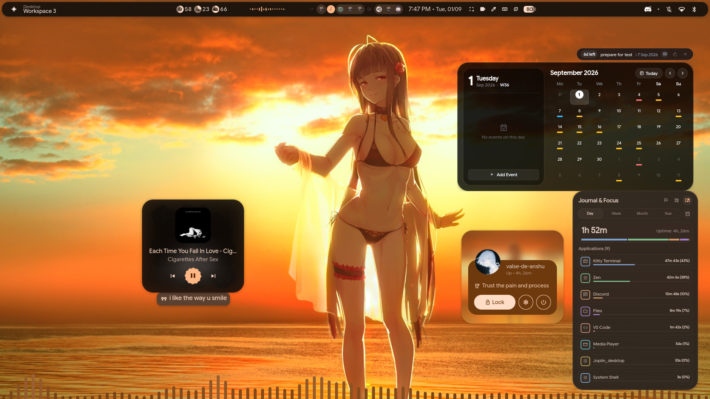
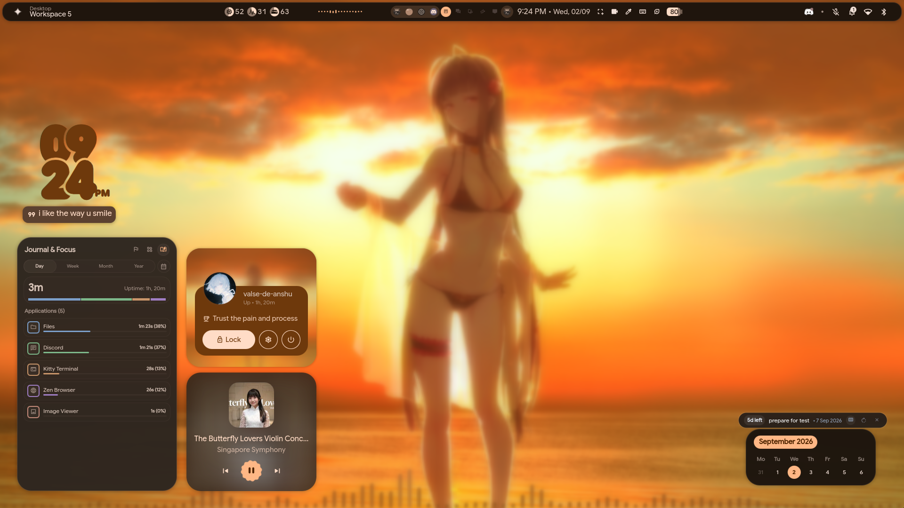

<div align="center">

# 🎼 Ballade
### A Modern Frosted-Glass Desktop Shell for Hyprland

[](https://hyprland.org/)
[](https://quickshell.outfoxxed.me/)
[](https://m3.material.io/)
[](docs/APP_THEMING_GUIDE.md)
[](FEATURES.md)

<br/>

**Ballade** is a complete, modular desktop environment and widget suite for **Hyprland**, built using **QuickShell** and Qt6 QML.  
It combines frosted-glass aesthetics with automatic **Material Design 3** color generation, 8 handcrafted color presets, synchronized terminal & app theming, live timed music lyrics, a 3D cover-flow wallpaper picker, and desktop productivity widgets.

<br/>

> 📖 **Looking for the deep technical breakdown?** Check out the full **[🌟 Ballade Feature Reference & Technical Architecture Guide](FEATURES.md)**!

<br/>

---

### 📸 Showcase

| 🌲 Forest Green & Widgets | 🔴 Crimson Red & YouTube `[CC]` |
| :---: | :---: |
|  |  |

| 🌸 Sakura Pink & Sidebar | 🔮 Amethyst Purple: rmpc & Fastfetch |
| :---: | :---: |
|  |  |

| 🌌 Tokyo Night Blue: Discord & Obsidian | 🪙 Golden Theme: Settings Hub |
| :---: | :---: |
|  |  |

| 🦊 Sunset Orange: VS Code & Micro | 🌑 Grayscale: Dolphin & Joplin |
| :---: | :---: |
|  |  |

| 🌇 3D Panorama Wallpaper Picker & Kitty | 📊 Focus Journal & Dynamic CAVA Visualizer |
| :---: | :---: |
|  |  |

| 🌫️ Blur Effect on Desktop |
| :---: |
|  |

---

</div>

<br/>

## 🧭 Table of Contents
- [🚀 Quick Start & Installation](#quick-start--installation)
- [📦 Prerequisites & Dependencies](#prerequisites--dependencies)
- [⌨️ Keybindings & Shortcuts](#keybindings--shortcuts)
- [🎨 Theming & Presets](#theming--presets)
- [🔧 Customization & Configuration](#customization--configuration)
- [❓ Troubleshooting & FAQ](#troubleshooting--faq)
- [🌟 Full Feature & Architecture Guide (`FEATURES.md`)](FEATURES.md)
- [💖 Credits & Upstream](#credits--upstream)

---

<a id="quick-start--installation"></a>
## 🚀 Quick Start & Installation

> [!IMPORTANT]
> **Base Layer Requirement**: Ballade runs directly on top of the **[illogical-impulse (`dots-hyprland`)](https://ii.clsty.link/en/ii-qs/01setup/#automated-installation)** base ecosystem. You must have the `illogical-impulse` base installed on your system before loading Ballade.

### Step 1: Install `illogical-impulse` Base Layer
Run the official automated installer from the [illogical-impulse setup guide](https://ii.clsty.link/en/ii-qs/01setup/#automated-installation):

```bash
bash <(curl -s https://ii.clsty.link/get)
```
*(Or clone manually from [end-4/dots-hyprland](https://github.com/end-4/dots-hyprland) and run `./setup install`)*

---

### Step 2: Clone & Deploy Ballade
Clone Ballade into your QuickShell configurations directory:

```bash
# Clone repository
git clone https://github.com/valse-de-anshu/Ballade.git ~/.config/quickshell/ballade

# Run setup script (links dotfiles & permissions)
cd ~/.config/quickshell/ballade
chmod +x setup.sh
./setup.sh
```

---

### Step 3: Set Ballade as Your Active Shell ( Autostart ballade ) -- optional

In `~/.config/hypr/custom/env.lua` (or `~/.config/hypr/hyprland/variables.lua`), set:
```lua
hl.env("qsConfig", "ballade")
```

---

### Step 4: Launch Ballade
```bash
qs -c ballade                  # 🚀 Launch Desktop Shell
```

---

<a id="prerequisites--dependencies"></a>
## 📦 Prerequisites & Dependencies

Package lists verified directly against an active Arch Linux desktop:

### 1. Official Arch Linux Repositories (`pacman`):
```bash
sudo pacman -S --needed \
    hyprland hyprpicker hyprsunset \
    matugen rmpc cava mpd \
    pipewire wireplumber pipewire-pulse playerctl libcanberra mpv yt-dlp \
    qt6-declarative qt6-5compat qt6-svg qt6-wayland qt6-multimedia qt6-imageformats qt6-shadertools \
    kitty konsole micro starship fastfetch btop jq fuzzel \
    wl-clipboard cliphist tesseract tesseract-data-eng \
    python python-mutagen python-pillow python-gobject \
    discord obsidian code
```

### 2. Arch User Repository (`yay` or `paru`):
```bash
yay -S --needed \
    quickshell-git \
    tela-circle-icon-theme-all \
    ttf-material-symbols-variable-git \
    ttf-readex-pro ttf-rubik-vf \
    vencord-installer-bin \
    zen-browser-bin \
    wlogout
```

### 3. Flatpak Applications (`flatpak`):
```bash
# Joplin Notes (Auto-themed via restart-joplin.py)
flatpak install flathub net.cozic.joplin_desktop

# Mission Center (Optional system telemetry task manager)
flatpak install flathub io.missioncenter.MissionCenter
```

---

<a id="keybindings--shortcuts"></a>
## ⌨️ Keybindings & Shortcuts

| Shortcut | Action | Description |
| :--- | :--- | :--- |
| `SUPER + A` | **Left Sidebar** | AI Assistant, Anime Gallery, Screen Translator |
| `SUPER + N` | **Right Sidebar** | Notifications, Quick Toggles, Volume Mixer, Calendar |
| `SUPER + Tab` / `SUPER + W` | **Overview** | Fullscreen workspace window switcher & app launcher |
| `CTRL + SUPER + T` | **Wallpaper Picker** | 3D Panoramic cover-flow wallpaper carousel |
| `SUPER + I` / `SUPER + ESC` | **Settings Hub** | Graphical configuration overlay |
| `SUPER + ALT + Space` | **Window Centering** | Toggle centered compact window focus mode |

### Terminal & Script IPC Triggers:
```bash
qs -c ballade ipc call sidebarLeft toggle        # Toggle Left Sidebar
qs -c ballade ipc call sidebarRight toggle       # Toggle Right Sidebar
qs -c ballade ipc call overview toggle           # Toggle App Launcher
qs -c ballade ipc call wallpaperSelector toggle  # Toggle 3D Wallpaper Carousel
qs -c ballade ipc call settings toggle           # Toggle Master Settings Hub
qs -c ballade ipc call sessionScreen toggle      # Toggle Power & Session Menu
```

---

<a id="theming--presets"></a>
## 🎨 Theming & Presets

Ballade includes **8 handcrafted color presets**. Switching presets or wallpapers automatically updates **16 desktop subsystems**:

| Preset | Accent | Description | Icon Theme |
| :--- | :---: | :--- | :--- |
| 🌲 **`green`** | `#7D9726` | Atelier Estuary natural sage | `Tela-circle-manjaro-dark` |
| 🌸 **`pink`** | `#E05688` | Vibrant Sakura orchid | `Tela-circle-pink-dark` |
| 🔴 **`red`** | `#D32F2F` | Crimson scarlet energy | `Tela-circle-red-dark` |
| 🔮 **`purple`** | `#9C27B0` | Amethyst midnight cyberpunk | `Tela-circle-purple-dark` |
| 🌌 **`blue`** | `#7AA2F7` | Tokyo Night ocean tranquility | `Tela-circle-blue-dark` |
| 🌟 **`golden`** | `#F0B849` | Warm espresso amber | `Tela-circle-yellow-dark` |
| 🍊 **`orange`** | `#FF9248` | Autumn dusk citrus | `Tela-circle-ubuntu-dark` |
| ❄️ **`grayscale`** | `#8892B0` | Distraction-free Nord slate | `Tela-circle-grey-dark` |

### Command to Switch Preset:
```bash
~/.config/quickshell/ballade/scripts/theming/apply-theme-preset.sh pink
```

📖 *For third-party app styling instructions, check out the [App Theming Guide](docs/APP_THEMING_GUIDE.md).*

---

<a id="customization--configuration"></a>
## 🔧 Customization & Configuration

* **Main Config File**: `~/.config/illogical-impulse/config.json`
* **Settings Hub (`SUPER + I`)**:
  - Toggle individual desktop widgets (Calendar, Weather, Clock, Screen Time, Music Player).
  - Adjust bar styling, corner shapes (`round`, `slanted`, `superellipse`, `cookie`), and font sizes.
  - Switch between panel layouts: **Illogical Impulse** (Modern Rice) or **Waffle** (Taskbar / Start Menu).
* **Adding Custom Wallpapers**:
  - Drop your wallpapers into `~/Pictures/Wallpapers/<preset_name>/` (e.g. `~/Pictures/Wallpapers/pink/`).

---

<a id="troubleshooting--faq"></a>
## ❓ Troubleshooting & FAQ

#### 1. QuickShell fails to start or reports missing QML modules
Ensure all required Qt6 QML runtime dependencies are installed:
```bash
sudo pacman -S --needed qt6-declarative qt6-5compat qt6-svg qt6-wayland qt6-multimedia qt6-imageformats qt6-shadertools
```

#### 2. CAVA or rmpc visualizer shows no audio bars
Make sure MPD's FIFO output is enabled. In `~/.config/mpd/mpd.conf`:
```text
audio_output {
    type    "fifo"
    name    "Visualizer feed"
    path    "/tmp/mpd.fifo"
    format  "44100:16:2"
}
```
Then restart MPD: `systemctl --user restart mpd.service`.

#### 3. Wallpaper colors do not apply to terminals
Verify that `matugen` is installed (`which matugen`) and ensure `include current-theme.conf` is in `~/.config/kitty/kitty.conf`.

---

<a id="credits--upstream"></a>
## 💖 Credits & Upstream

- **[end-4/dots-hyprland](https://github.com/end-4/dots-hyprland)**: The original **Illogical Impulse (`ii`)** base framework.
- **[pctrade/end4-pC](https://github.com/pctrade/end4-pC)**: extra personal rice (end4-pC) on top of (ii).
- **[outfoxxed/quickshell](https://github.com/outfoxxed/quickshell)**: Wayland QML desktop shell engine.
- **[Hyprland](https://hyprland.org/)**: Dynamic tiling Wayland compositor.

<br/>

<div align="center">

Crafted with care by **[Anshu (valse-de-anshu)](https://github.com/valse-de-anshu)**  
*Elevate your desktop experience.*

</div>
