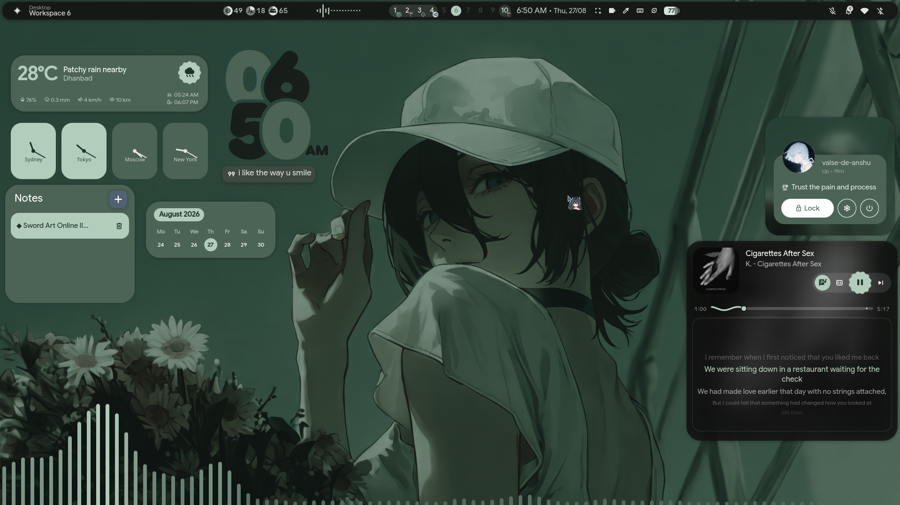
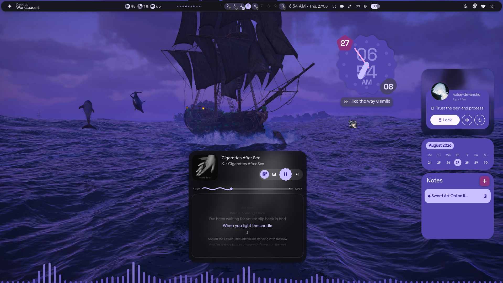
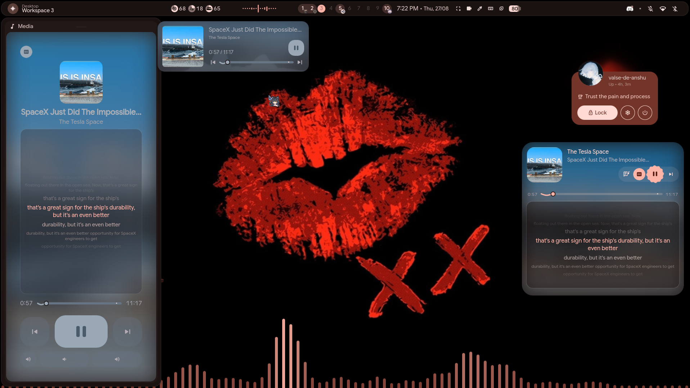
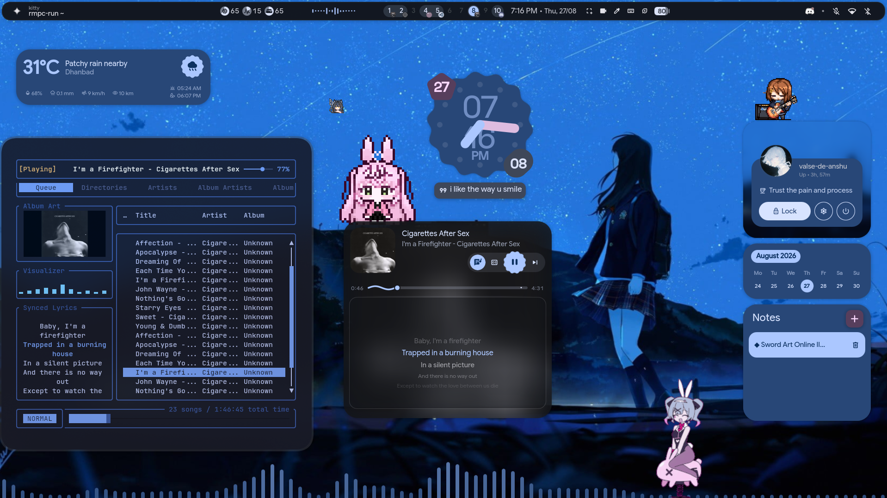
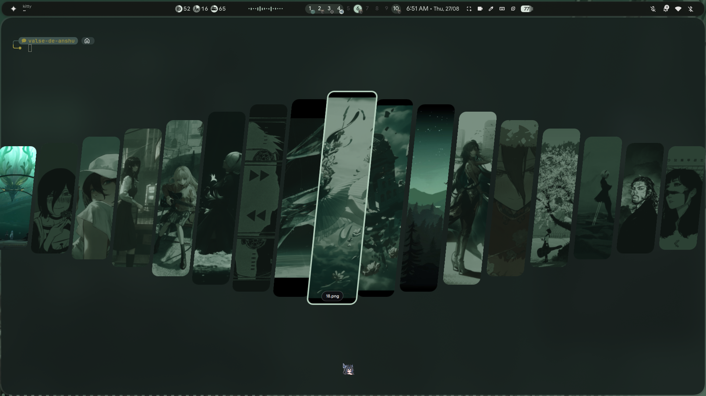
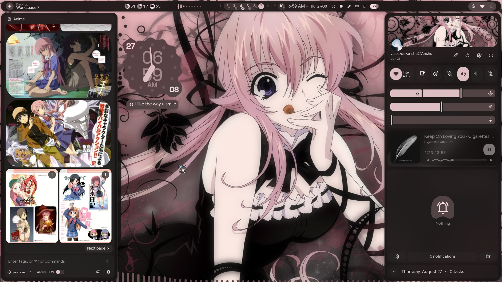
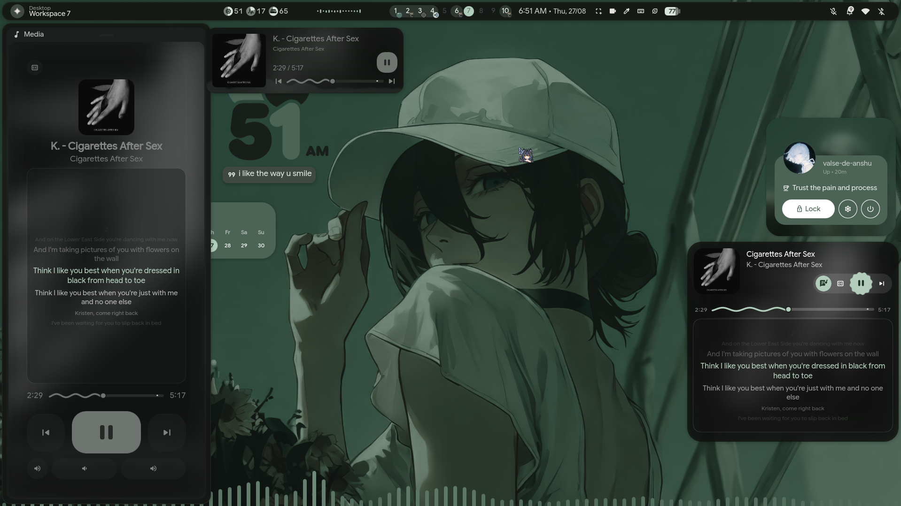
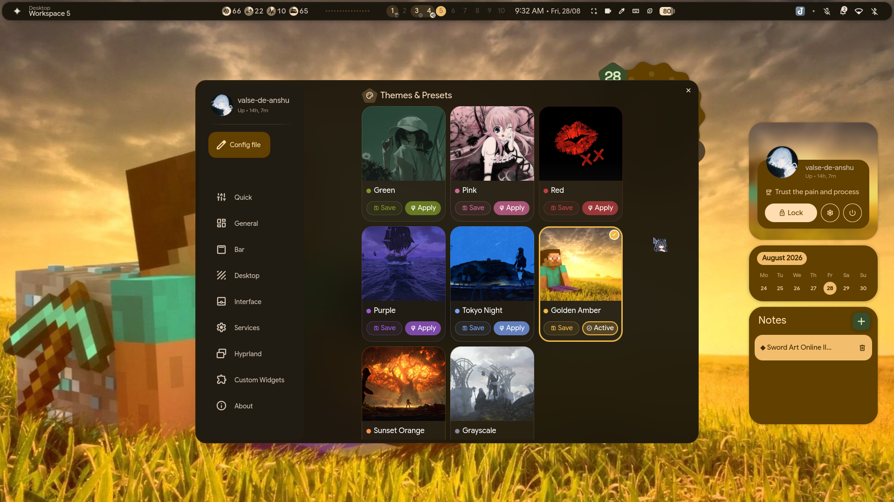
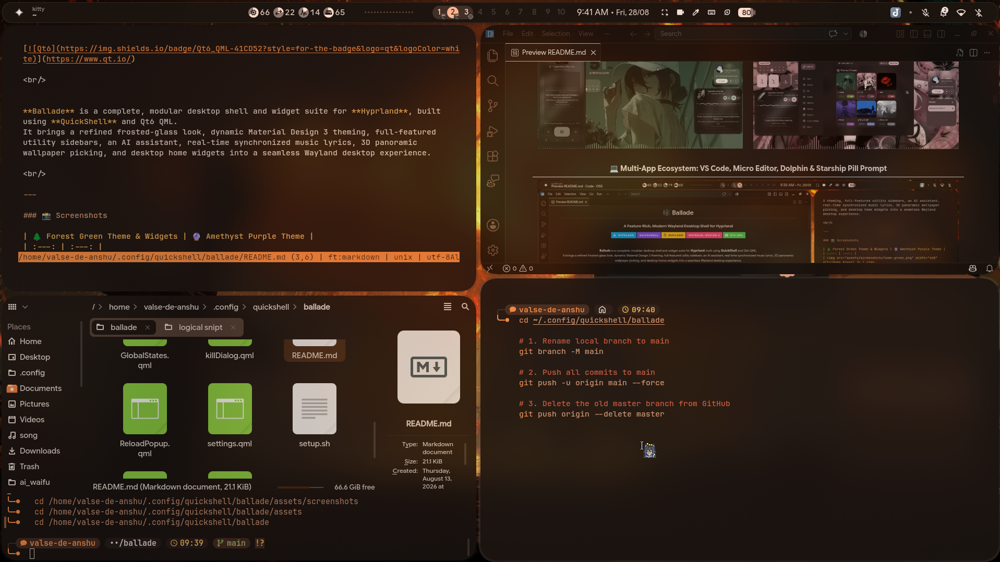

<div align="center">

# 🎼 Ballade
### A Feature-Rich, Modern Wayland Desktop Shell for Hyprland

[](https://hyprland.org/)
[](https://quickshell.outfoxxed.me/)
[](https://wayland.freedesktop.org/)
[](https://m3.material.io/)
[](https://www.qt.io/)

<br/>


**Ballade** is a complete, modular desktop shell and widget suite for **Hyprland**, built using **QuickShell** and Qt6 QML.  
It brings a refined frosted-glass look, dynamic Material Design 3 theming, full-featured utility sidebars, an AI assistant, real-time synchronized music lyrics, 3D panoramic wallpaper picking, and desktop home widgets into a seamless Wayland desktop experience.

<br/>

---

### 📸 Screenshots

| 🌲 Forest Green Theme & Widgets | 🔮 Amethyst Purple Theme |
| :---: | :---: |
|  |  |

| 🔴 Crimson Red Theme & YouTube Subtitles `[CC]` | 🌌 Tokyo Night Blue, rmpc & Animated GIFs |
| :---: | :---: |
|  |  |

| 🌌 3D Panoramic Wallpaper Picker | 🌸 Sakura Pink Theme & Sidebar |
| :---: | :---: |
|  |  |

| 🎵 Music Player & Synced Lyrics | ⚙️ Themes & Settings Hub (8 Presets) |
| :---: | :---: |
|  |  |

| 💻 Multi-App Ecosystem: VS Code, Micro Editor, Dolphin & Kitty Terminal |
| :---: |
|  |

---

</div>

<br/>

## 🧭 Table of Contents
- [⚡ Quick Start](#-quick-start)
- [✨ Key Features & Modules](#-key-features--modules)
- [🎨 Dynamic Theming & Multi-App Engine](#-dynamic-theming--multi-app-configuration-engine)
- [⌨️ IPC & Keybinding Shortcuts](#️-ipc--keybinding-shortcuts)
- [📦 System Prerequisites](#-system-prerequisites--dependencies)
- [📂 Directory Anatomy](#-directory-anatomy)
- [💖 Credits & Upstream](#-credits--upstream)

---

## ⚡ 60-Second Quick Start

Ballade is built on top of the **`illogical-impulse`** (`dots-hyprland`) base framework. Follow these 3 simple steps to get running:

---

### Step 1: Install Base Layer — `illogical-impulse`
> [!IMPORTANT]
> **Ballade requires `illogical-impulse` as its base foundation.**
> Refer to the official [illogical-impulse Installation Guide](https://ii.clsty.link/en/ii-qs/01setup/#automated-installation).

Run the automated one-line installer for Arch Linux / CachyOS / EndeavourOS:
```bash
bash <(curl -s https://ii.clsty.link/get)
```
*(Or manually clone and run: `git clone --recursive https://github.com/end-4/dots-hyprland ~/.cache/dots-hyprland && cd ~/.cache/dots-hyprland && ./setup install`)*

---

### Step 2: Download & Install `Ballade`
Clone Ballade directly into your QuickShell configurations folder and run the automated initializer:

```bash
# 1. Clone into QuickShell directory
git clone https://github.com/valse-de-anshu/Ballade.git ~/.config/quickshell/ballade

# 2. Run 1-Click Environment Setup (Installs all app dotfiles, Hyprland custom rules & themes)
cd ~/.config/quickshell/ballade
./setup.sh
```

---

### Step 3: Set Ballade as Active Shell & Launch

- **In `~/.config/hypr/custom/env.lua` or `~/.config/hypr/hyprland/variables.lua`:**
  ```lua
  hl.env("qsConfig", "ballade")
  ```
- **Or launch immediately from your terminal:**
  ```bash
  qs -c ballade
  ```

---

## ✨ Key Features & Modules

### 🌲 1. Top Status Bar (Ditto `ii` Bar + `end4-pC` Visualizer)
* **Living Workspaces**: Dynamic morphing dot indicators tracking active, occupied, and empty virtual desktops across single and multi-monitor setups.
* **Active Window Information**: Live window title display and application class detection.
* **Audio Waveform Visualizer**: Animated sound wave visualizer reacting to audio in real-time. Left-click opens track preview & controls (`MediaControls.qml`); right-click toggles play/pause.
* **Jitter-Free Hardware Telemetry**: CPU %, RAM %, Swap %, and Temp meters locked with OpenType tabular figures (`tnum`) to eliminate number twitching. Swap automatically reveals itself when swap memory is actively in use (`> 0%`).
* **Interactive System Tray & Quick Icons**: Wayland status notifier tray, Wi-Fi SSID / Ethernet status, Bluetooth, Battery percentage with charging states, and Volume indicators.
* **Update Tracker & Calendar**: Pending system updates counter with a 1-click terminal launcher, plus formatted time/date with click-to-open calendar popup and world timezone clock.
* **Vertical Bar Mode (`modules/ii/verticalBar/`)**: Full alternative side-docked bar orientation.

### 🧠 2. Intelligent Left Sidebar (`end4-pC` + `ballade`)
* **Conversational AI Companion**: Direct chat client supporting Google Gemini API, local Ollama models (`llama3`, `deepseek`), and OpenAI ChatGPT with Markdown rendering, code highlighting, and chat history.
* **Live Side-by-Side Translator**: Full translator (Google Translate / DeepL) with auto-detection, character counter, quick copy/search buttons, and a compact modal language selector (`SelectionDialog.qml`).
* **Acoustic Player & Synced Lyrics**: Seekable wavy progress slider with an ergonomic circular knob handle, track cover preview, and real-time timed subtitle streaming for English, Hindi, and LRC lyrics.
* **YouTube Subtitle Streaming (`[CC]` Button)**: Dedicated **`[CC]`** caption button that instantly fetches and streams real-time YouTube subtitles/captions via `yt-dlp` directly on your desktop.
* **Sidebar Master Volume Controls**: Dedicated volume up/down/mute buttons connected to master PipeWire volume with instant On-Screen Display (OSD) HUD feedback.
* **Booru Art Explorer**: Search and browse anime art and wallpaper boards with tag search and a 1-click "Apply as Wallpaper" shortcut.

### 🎚️ 3. Tactile Right Sidebar / Control Center (`end4-pC`)
* **Quick-Toggle Tiles**: 1-click toggles for Wi-Fi, Bluetooth, Night Light (Gamma temperature), Anti-Flashbang shader, Audio Sink Router, and Pomodoro Timer.
* **Master QuickSliders**: Smooth touch- and mouse-friendly sliders for Master Volume, Microphone Input Gain, and Display Brightness.
* **Live Audio Sink/Source Router**: Expandable output selector to redirect playback between Headphones, Speakers, Bluetooth headsets, and HDMI outputs on the fly.
* **Network & Bluetooth Dialogs**: Wi-Fi network scanner with password prompt and Bluetooth device pairing/connecting manager.
* **Pomodoro Focus Timer**: Customizable work/break focus timer with notification audio cues.
* **Notification History Center**: Grouped notifications with actionable buttons, timestamps, and one-click clear.

### 🌌 4. 3D Panoramic Cover-Flow Wallpaper Picker (`ballade`)
* **Panoramic 3D Cover-Flow View**: Displays every wallpaper in the active preset directory across the screen in an uninterrupted panoramic arc without horizontal pagination clipping.
* **Interactive Center Scale**: Fluid zoom and border highlight on hovered wallpapers with keyboard arrow navigation and instant Material You color extraction.

### 🖥️ 5. Desktop Home Widgets & Mascot GIFs (`end4-pC` + `ballade`)
* **Frosted Desktop Music Player**: Floating music card with wavy progress tracks, lyrics, and YouTube `[CC]` toggle.
* **Unlimited Desktop Mascot GIFs & Stickers**: Place, scale, and layer unlimited animated GIF mascots, stickers, and pixel pets directly on your desktop canvas.
* **`rmpc` Music Client Integration**: Synchronized styling and color-matching for the `rmpc` (Rust Music Player Client) terminal music player.
* **World Telemetry & Clocks**: Live weather telemetry from `wttr.in`, geographic dot-map locator projection, and customizable digital, analog, and pixel clocks.
* **Persistent Desktop Notes & Tasks**: Auto-saving sticky notes and to-do checklists.

### 🪟 6. Overlays, Hubs & System Screens (`end4-pC`)
* **App Launcher / Overview (`modules/ii/overview/`)**: Full-screen fuzzy app search, math calculator, command execution, and window switcher.
* **Session & Power Screen (`modules/ii/sessionScreen/`)**: Fullscreen power menu with Lock, Logout, Suspend, Hibernate, Reboot, and Shutdown triggers.
* **Screen Region Translator (`modules/ii/screenTranslator/`)**: Snip any region on your screen to perform real-time OCR text extraction and translation.
* **On-Screen Display HUD (`modules/ii/onScreenDisplay/`)**: Non-intrusive overlays for Volume percentage, Brightness level, and Night Light Gamma.
* **Virtual On-Screen Keyboard & Cheatsheet**: Touch-friendly virtual keyboard for 2-in-1s and searchable Hyprland keybindings cheatsheet.
* **Lock Screen (`modules/common/panels/lock/`)**: Frosted glass lockscreen with PAM authentication, password input, media controls, and battery status.

### ⚙️ 7. Master Settings Overlay (`SUPER + I` or `SUPER + Escape` / `modules/ii/settings/`)
* **8 Comprehensive Configuration Pages**: Quick Config, Bar Configuration, Interface & Corner Shapes (`round`, `slanted`, `superellipse`, `cookie`), Desktop Widgets, Profile Info, Hyprland Rules, Services & Audio Steppers, and General Options.
* **Auto-Saving**: All changes write directly to `~/.config/illogical-impulse/config.json`.

### 🔊 8. Audio Events & System Sound Cues (`scripts/` & `assets/`)
* **Bundled Sound Library**: Built-in audio cues for Startup, Shutdown, Lock session, Logout, Sleep, Battery Low, and USB connect/disconnect.
* **Low-Latency Player Fallback**: Automatic multi-backend audio pipeline (`pw-play` ➔ `paplay` ➔ `mpv` ➔ `canberra-gtk-play`).

### 🪟 9. Bundled Hyprland Custom Configuration (`hyprland-custom/`)
Ballade includes full Hyprland override configs inside `hyprland-custom/` that get installed to `~/.config/hypr/custom/`:
* **Frosted Glass Blur (`general.lua`)**: `size = 16`, `passes = 4`, `contrast = 1.0`, `vibrancy = 0.35`.
* **Window Transparency Rules (`rules.lua`)**: `opacity = "0.93 0.88"` for all application windows.
* **Keybinding Integrations (`keybinds.lua`)**:
  - `SUPER + I` or `SUPER + ESC`: Toggle Settings Overlay
  - `CTRL + SUPER + T`: Toggle 3D Panoramic Wallpaper Picker
  - `SUPER + ALT + Space`: Toggle Compact Centered Window
* **Cursor Restoration (`execs.lua`)**: Sets `Gloomi_x` cursor automatically on startup.

---

## 🎨 Dynamic Theming & Multi-App Configuration Engine

Ballade features an automated, multi-tier theming pipeline: **Dynamic Material Design 3 extraction** from any wallpaper, plus **8 handcrafted, perfectly harmonized theme presets**:

| Preset | Accent Hue | Command Palette | Philosophy | Icon Theme | KDE Color Scheme |
| :--- | :---: | :--- | :--- | :--- | :--- |
| 🌲 **`green`** | `#7D9726` | Forest Sage / Olive | Atelier Estuary calm, natural focus | `Tela-circle-manjaro-dark` | `Atelier_Estuary_Dark` |
| 🌸 **`pink`**  | `#D4659A` | Deep Rose / Orchid | Sakura vibrant anime aesthetic | `Tela-circle-pink-dark` | `PinkDark` |
| 🔴 **`red`**   | `#BF3F43` | Crimson / Salmon | High-energy scarlet with pure error alerts | `Tela-circle-red-dark` | `RedDark` |
| 🔮 **`purple`**| `#9C5ADB` | Amethyst / Lavender | Cyberpunk midnight with glowing accents | `Tela-circle-purple-dark` | `PurpleDark` |
| 🌌 **`blue`**  | `#7AA2F7` | Cyan / Tokyo Navy | Tokyo Night deep ocean tranquility | `Tela-circle-blue-dark` | `TokyoNightDark` |
| 🌟 **`golden`**| `#F0B849` | Luminous Amber / Gold | Warm honey espresso with radiant topaz | `Tela-circle-yellow-dark` | `GoldenDark` |
| 🍊 **`orange`**| `#FF9248` | Autumn Sunset / Citrus | Roasted cocoa dusk with glowing citrus | `Tela-circle-ubuntu-dark` | `OrangeDark` |
| ❄️ **`grayscale`** | `#8892B0` | Nord Slate / Frost | Distraction-free monochrome productivity | `Tela-circle-grey-dark` | `NordDark` |

---

### 🛠️ What Our Scripts Automate Across Your System (11 Connected Subsystems):

When you apply a preset from the **Settings Hub (`SUPER + I`)**, run `scripts/theming/apply-theme-preset.sh`, or switch a wallpaper via `scripts/colors/switchwall.sh`, Ballade automatically synchronizes **11 core subsystems** across your desktop environment in real-time:

1. **🖥️ QuickShell Desktop & Shell UI**:
   - Automatically extracts Material Design 3 tokens into `~/.local/state/quickshell/user/generated/colors.json` from the active preset's wallpaper folder (`~/Pictures/Wallpapers/<preset>/`).
   - Top status bar, audio visualizer, sidebars, desktop widgets, and OSD HUDs instantly repaint.
2. **🐱 Kitty Terminal**:
   - Injects full 16-color ANSI palettes into `~/.config/kitty/current-theme.conf` and reloads live terminals via `kill -SIGUSR1` without disrupting active shell sessions.
3. **💻 Konsole & Dolphin Embedded Terminal**:
   - Generates native RGB color maps in `~/.local/share/konsole/Quickshell.colorscheme` and registers `ColorScheme=Quickshell` in `~/.config/konsolerc` and active profiles.
4. **🚀 Starship Shell Prompt**:
   - Deploys full **Unixporn Pill Prompts** (`~/.config/starship.toml`) with Live Time, Directory Glyphs, and Git Branch status pills customized for each theme.
5. **📝 Micro Text Editor (TUI)**:
   - Generates and activates custom syntax and UI colorschemes in `~/.config/micro/colorschemes/ballade.micro` (`"colorscheme": "ballade"`).
6. **💻 VS Code, VSCodium, Cursor & Antigravity IDEs**:
   - Injects 60+ keys of `workbench.colorCustomizations` (empty editor background, watermarks, shortcut badges, rainbow brackets) and syntax token colors (`editor.tokenColorCustomizations`) via `scripts/theming/apply-code-theme.sh`.
7. **🎵 rmpc Music Player (TUI)**:
   - Switches active theme in `~/.config/rmpc/config.ron` using 8 bundled `.ron` color themes in `dotfiles/rmpc/themes/`.
8. **🐬 Dolphin File Manager & KDE Plasma**:
   - Deploys custom KDE color schemes (`GoldenDark.colors`, `OrangeDark.colors`, etc.) to `~/.local/share/color-schemes/` and applies them live via `plasma-apply-colorscheme` and `kdeglobals` AccentColor.
9. **🏷️ GTK 3 / GTK 4 & Icon Themes**:
   - Updates `gsettings` and `kdeglobals` to apply dedicated `Tela-circle-*` icon packs and dark mode themes.
10. **🎨 Kvantum Qt Theme Engine**:
    - Recompiles and applies Material SVG themes via `scripts/kvantum/materialQT.sh`.
11. **🖱️ Custom System Cursor (`Gloomi_x`)**:
    - Bundled `Gloomi-x-Cursor-Custom` in `dotfiles/icons/` installed to `~/.icons/` and auto-loaded by Hyprland on startup.

---

## ⌨️ IPC & Keybinding Shortcuts

Control shell modules from Hyprland keybindings or terminal scripts:

```bash
qs -c ballade ipc call sidebarLeft toggle        # Left Sidebar (AI, Translator, Music)
qs -c ballade ipc call sidebarRight toggle       # Right Sidebar (Control Center, Sliders)
qs -c ballade ipc call overview toggle           # App Launcher & Window Overview
qs -c ballade ipc call wallpaperSelector toggle  # 3D Panoramic Wallpaper Carousel (CTRL+SUPER+T)
qs -c ballade ipc call settings toggle           # Master Settings Hub (SUPER+I or SUPER+ESC)
qs -c ballade ipc call mediaControls toggle      # Music Player Popup & Seek
qs -c ballade ipc call sessionScreen toggle      # Power & Session Menu (Lock/Shutdown)
qs -c ballade ipc call osdVolume trigger         # Volume On-Screen Display HUD
qs -c ballade ipc call cheatsheet toggle         # Keybindings Cheatsheet
qs -c ballade ipc call cliphist toggle           # Clipboard History Manager
```

## 📦 System Prerequisites & Dependencies

### ⚡ 1-Click Package Installation Commands (Verified on Arch / CachyOS / EndeavourOS)

#### Option A: Using `yay` (Recommended — Installs All Official Packages + AUR Tools):
```bash
yay -S --needed quickshell hyprland qt6-declarative qt6-5compat qt6-svg qt6-wayland qt6-multimedia \
    pipewire wireplumber playerctl libcanberra mpv yt-dlp cava \
    kitty micro starship fastfetch btop rmpc wlogout \
    jq python python-mutagen wl-clipboard cliphist tesseract tesseract-data-eng \
    hyprpicker hyprsunset fuzzel kvantum matugen-bin
```

#### Option B: Using `pacman` (Official Repositories):
```bash
sudo pacman -S --needed quickshell hyprland qt6-declarative qt6-5compat qt6-svg qt6-wayland qt6-multimedia \
    pipewire wireplumber playerctl libcanberra mpv yt-dlp cava \
    kitty micro starship fastfetch btop rmpc \
    jq python python-mutagen wl-clipboard cliphist tesseract tesseract-data-eng \
    hyprpicker hyprsunset fuzzel kvantum
```

---

| Domain | Required Packages | Purpose |
| :--- | :--- | :--- |
| **Compositor & Shell** | `hyprland`, `quickshell`, `qt6-declarative`, `qt6-5compat`, `qt6-svg`, `qt6-wayland` | Wayland compositing and QML widget rendering |
| **Audio Server & Media** | `pipewire`, `wireplumber`, `playerctl`, `canberra-gtk-play`, `mpv`, `pw-play` | PipeWire volume scaling, MPRIS player controls, sound events |
| **Media & Lyrics Engine** | `yt-dlp`, `playerctl`, `mpv` | Real-time YouTube CC caption extraction and media streaming |
| **Dynamic Theming** | `matugen`, `kitty`, `konsole`, `plasma-apply-colorscheme`, `tela-circle-icon-theme-git` | Material You color extraction, Kitty/Konsole terminal palettes |
| **Utilities & OCR** | `jq`, `wl-clipboard`, `cliphist`, `tesseract`, `tesseract-data-eng`, `hyprpicker`, `hyprsunset` | Clipboard manager, screen OCR translation, night light gamma |
| **Hardware & Sensors** | `brightnessctl`, `ddcutil`, `upower`, `acpi`, `nmcli`, `bluetoothctl` | Backlight brightness, battery telemetry, Wi-Fi & Bluetooth |
| **Python Ecosystem** | `python-tqdm`, `faster-whisper`, `google-generativeai` | Synchronized lyrics streaming, offline transcription, Gemini AI |

---

## 📂 Directory Anatomy

```text
ballade/
├── assets/                  # High-res icons, bundled sound effects (USB, power), and screenshots
├── dotfiles/                # Complete bundled application configurations & custom cursors
│   ├── color-schemes/       # KDE / Dolphin color schemes (GoldenDark, OrangeDark, TokyoNight, etc.)
│   ├── icons/               # Gloomi_x custom cursor theme
│   ├── rmpc/                # rmpc music player config & 8 themes (.ron)
│   ├── mpv/                 # mpv configuration, input binds, and cinematic shaders
│   ├── starship/            # 8 unified Unixporn Pill Starship prompt themes
│   ├── micro/               # Micro text editor configs & syntax colorschemes
│   ├── kitty/               # Kitty terminal configs & color themes
│   └── fastfetch, cava, btop, wlogout, fuzzel
├── hyprland-custom/         # Custom Hyprland overrides (blur rules, opacities, keybinds, compact window)
├── modules/
│   ├── common/              # Shared components (MaterialShape, StyledSlider, SelectionDialog, Config)
│   ├── ii/                  # Illogical Impulse UI panels (bar, sidebars, overview, settings, wallpapers)
│   └── waffle/              # Alternative panel components
├── panelFamilies/           # Panel family definitions (IllogicalImpulseFamily.qml)
├── scripts/
│   ├── colors/              # switchwall.sh, applycolor.sh, generate_colors_material.py
│   ├── theming/             # apply-theme-preset.sh, apply-code-theme.sh, apply-micro-theme.sh
│   ├── kvantum/             # Material Kvantum / Qt widget theme generators
│   ├── lyrics/              # Real-time multi-language synchronized lyrics engine
│   └── play-usb-audio.sh    # Low-latency USB hardware event player
├── services/                # Reactive singletons (Audio.qml, MprisController.qml, Wallpapers.qml, Presets.qml)
├── translations/            # Localization dictionary files (en_US, zh_CN, etc.)
├── GlobalStates.qml         # Central state manager for modal visibility
├── setup.sh                 # 1-Click environment initializer & permissions setup
└── shell.qml                # Root entrypoint
```

---

## 💖 Credits & Upstream

- **[end-4/dots-hyprland](https://github.com/end-4/dots-hyprland)**: The original **Illogical Impulse (`ii`)** — base architecture, frosted glass styling, and top bar design.
- **[pctrade/end4-pC](https://github.com/pctrade/end4-pC)**: The custom fork that contributed the sidebar modules, AI chat, translator, and settings overlay.
- **[outfoxxed/quickshell](https://github.com/outfoxxed/quickshell)**: The QML desktop shell engine for Wayland.
- **[Hyprland](https://hyprland.org/)**: Dynamic tiling Wayland compositor.


---

<div align="center">

Crafted with passion by **[Anshu (valse-de-anshu)](https://github.com/valse-de-anshu)**  
*Elevate your desktop experience.*

</div>
