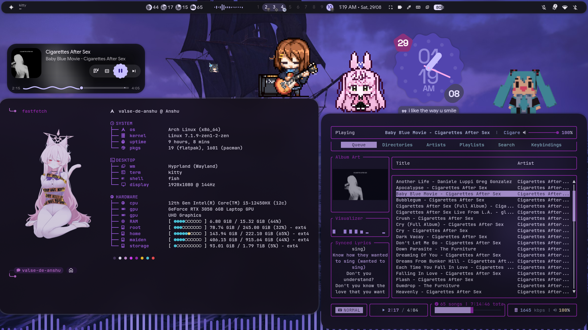
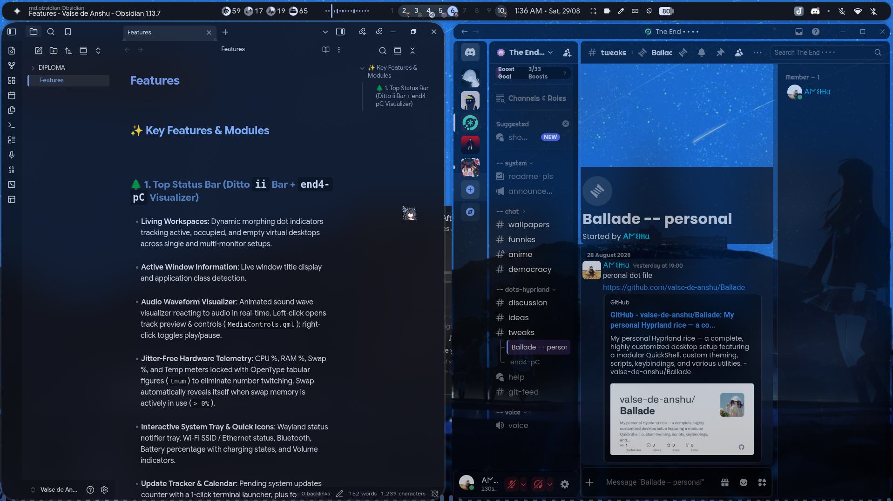
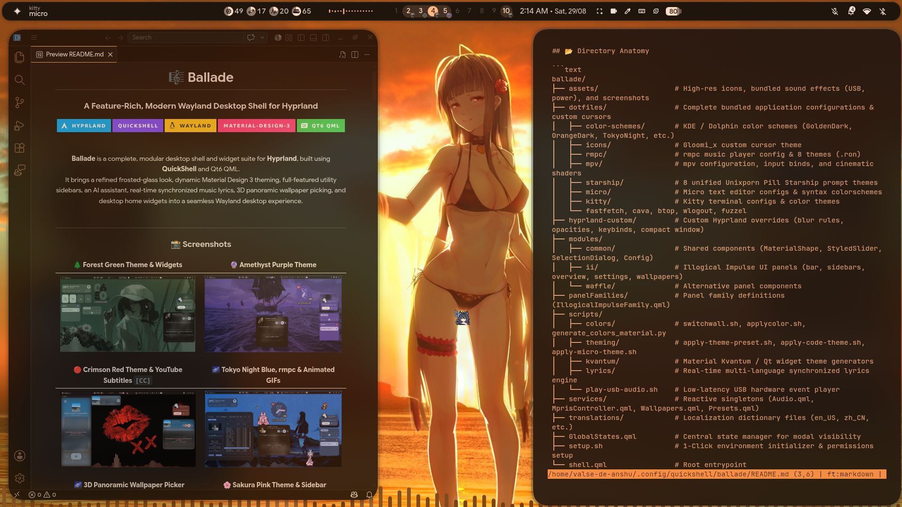
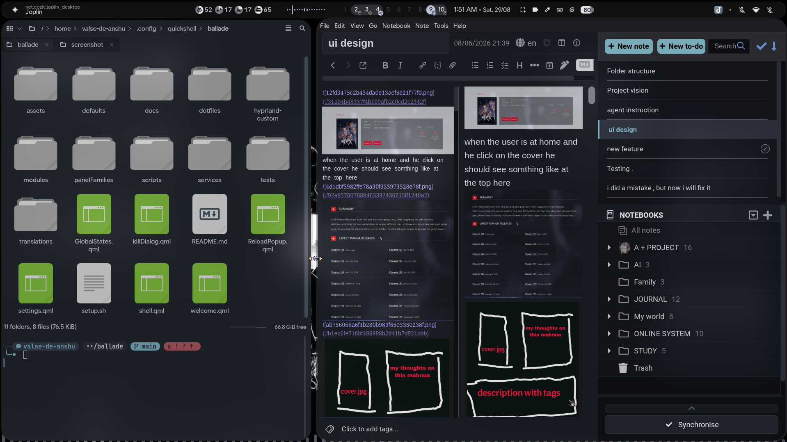
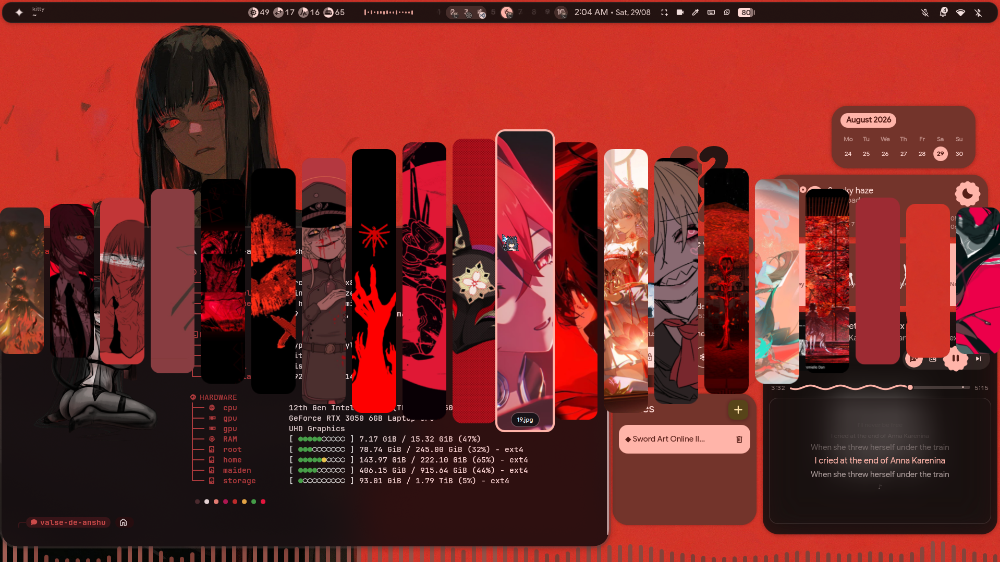
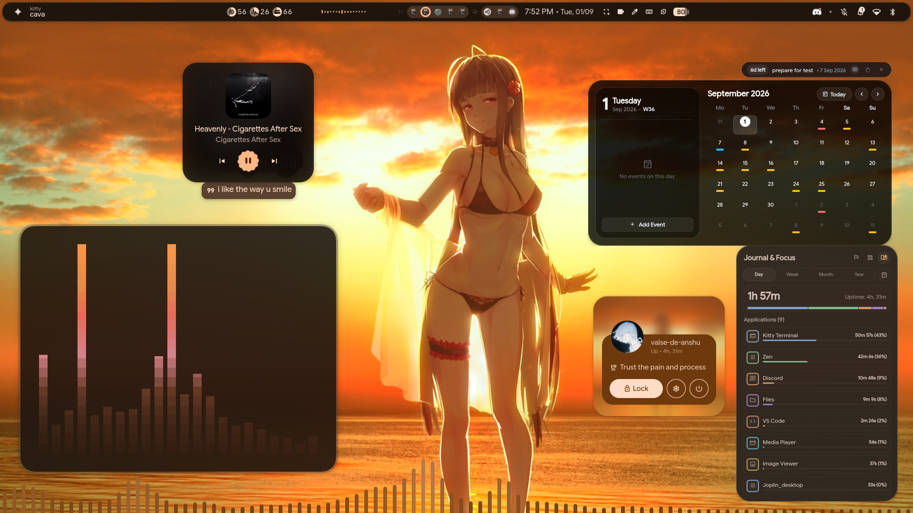

<div align="center">

# 🎼 Ballade
### A Modern Frosted-Glass Desktop Shell for Hyprland

[](https://hyprland.org/)
[](https://quickshell.outfoxxed.me/)
[](https://m3.material.io/)
[](docs/APP_THEMING_GUIDE.md)

<br/>

**Ballade** is a complete, modular desktop environment and widget suite for **Hyprland**, built using **QuickShell** and Qt6 QML.  
It combines frosted-glass aesthetics with automatic **Material Design 3** color generation, 8 handcrafted color presets, synchronized terminal & app theming, live timed music lyrics, a 3D cover-flow wallpaper picker, and desktop productivity widgets.

<br/>

---

### 📸 Showcase

| 🌲 Forest Green & Widgets | 🔴 Crimson Red & YouTube `[CC]` |
| :---: | :---: |
|  |  |

| 🌸 Sakura Pink & Sidebar | 🔮 Amethyst Purple: rmpc & Fastfetch |
| :---: | :---: |
|  |  |

| 🌌 Tokyo Night Blue: Discord & Obsidian | 🪙 Golden Theme: Settings Hub |
| :---: | :---: |
|  |  |

| 🦊 Sunset Orange: VS Code & Micro | 🌑 Grayscale: Dolphin & Joplin |
| :---: | :---: |
|  |  |

| 🌇 3D Panorama Wallpaper Picker & Kitty | 📊 Focus Journal & Dynamic CAVA Visualizer |
| :---: | :---: |
|  |  |

---

</div>

<br/>

## 🧭 Table of Contents
- [✨ What's Inside](#-whats-inside)
- [📦 Prerequisites & Dependencies](#-prerequisites--dependencies)
- [🚀 Installation & Setup](#-installation--setup)
- [⌨️ Keybindings & Shortcuts](#-keybindings--shortcuts)
- [🎨 Theming & Presets](#-theming--presets)
- [🔧 Customization](#-customization)
- [❓ Troubleshooting & FAQ](#-troubleshooting--faq)
- [💖 Credits & Upstream](#-credits--upstream)

---

## ✨ What's Inside

### 🌲 Top Status Bar
- **Living Workspaces**: Animated dot indicators tracking occupied, empty, and active virtual desktops across single and multi-monitor setups.
- **Audio Waveform Meter**: Real-time sound level meter. Left-click opens track preview & player controls; right-click toggles play/pause.
- **Hardware Telemetry**: Monospace figures for CPU %, RAM %, Temperature, and auto-revealing Swap %.
- **System Tray**: Wayland status notifier tray for background applications, network status, Bluetooth, Battery, and Volume.

### 🧠 Left Sidebar (`Super + A` or Edge Swipe)
- **AI Assistant**: Built-in chat client supporting Google Gemini API, local Ollama models (`llama3`, `deepseek`), and ChatGPT.
- **Live Translator**: Side-by-side translator with automatic language detection, character counter, and quick copy/search buttons.
- **Synced Lyrics Player**: Real-time timed subtitle streaming for local files and Spotify/MPRIS.
- **YouTube `[CC]` Caption Extractor**: Streams live synchronized subtitles directly from playing YouTube videos via `yt-dlp`.

### 🎚️ Right Control Center (`Super + N` or Edge Swipe)
- **Master Sliders**: Touch- and mouse-friendly controls for Volume, Input Gain, and Display Brightness.
- **Quick-Toggle Tiles**: 1-click toggles for Wi-Fi, Bluetooth, Night Light (Gamma), Anti-Flashbang shader, and Pomodoro timer.
- **Live Audio Router**: Instantly switch audio output between Headphones, Speakers, and Bluetooth devices.
- **Notification History**: Grouped notification center with actionable buttons and one-click clear.

### 📊 Focus Journal & Productivity Widget
- **Screen Time Tracker**: Real-time 1-second precision window and active tab tracking via Hyprland IPC (`hyprctl activewindow -j`).
- **Multi-Horizon Views**: Switch between Day, Week, Month, and Year statistics with uptime and average counters.
- **Per-App Activity Drilldown**: Click any application to see a detailed activity log of all visited websites, tabs, and documents with exact time spent.
- **Interactive Calendar Matrix**: Jump back to any date in the calendar to review historical journaling and screen time records.
- **5-Horizon Goals & Tools**: Goal setting with progress rings, plus built-in To-Do checklist, Scratchpad notes, and Pomodoro timer.

### 🌌 3D Panoramic Wallpaper Picker (`Ctrl + Super + T`)
- **Cover-Flow Arc**: Displays all wallpapers from your theme preset directory in a panoramic 3D arc.
- **Instant Color Extraction**: Selecting a wallpaper automatically generates a matching Material You palette across your system.

---

## 📦 Prerequisites & Dependencies

### 1. Official Arch Linux Repositories (`pacman`)
The core environment, tools, and visualizers are available directly in official repos:
```bash
sudo pacman -S --needed     hyprland matugen rmpc cava     qt6-declarative qt6-5compat qt6-svg qt6-wayland qt6-multimedia     pipewire wireplumber playerctl libcanberra mpv yt-dlp     kitty micro starship fastfetch btop     jq python python-mutagen wl-clipboard cliphist tesseract tesseract-data-eng     hyprpicker hyprsunset fuzzel kvantum     discord obsidian code
```

### 2. AUR Packages (`yay` or `paru`)
```bash
yay -S --needed     quickshell-git     tela-circle-icon-theme-all     vencord-installer-bin
```

### 3. Flatpak (Optional)
If you prefer running Joplin via Flatpak (with automatic tray theming support built-in):
```bash
flatpak install flathub net.cozic.joplin_desktop
```

---

## 🚀 Installation & Setup

Ballade is built on top of the **`illogical-impulse`** (`dots-hyprland`) base. Follow these simple steps to install:

### Step 1: Install Base Layer (`illogical-impulse`)
Run the official one-line base installer:
```bash
bash <(curl -s https://ii.clsty.link/get)
```
*(Or manually clone from [end-4/dots-hyprland](https://github.com/end-4/dots-hyprland) and run `./setup install`)*

### Step 2: Clone Ballade
Clone Ballade directly into your QuickShell configurations directory:
```bash
git clone https://github.com/valse-de-anshu/Ballade.git ~/.config/quickshell/ballade
```

### Step 3: Run Environment Setup
Run the setup script to copy bundled dotfiles, cursor themes, and set script permissions:
```bash
cd ~/.config/quickshell/ballade
chmod +x setup.sh
./setup.sh
```

### Step 4: Set as Active Shell
Add or update the shell variable in your `~/.config/hypr/custom/env.lua` (or `~/.config/hypr/hyprland/variables.lua`):
```lua
hl.env("qsConfig", "ballade")
```

### Step 5: Launch
Start or restart QuickShell:
```bash
qs -c ballade
```

---

## ⌨️ Keybindings & Shortcuts

| Shortcut | Description |
| :--- | :--- |
| `SUPER + I` or `SUPER + ESC` | Open Master Settings Hub |
| `CTRL + SUPER + T` | Open 3D Panoramic Wallpaper Picker |
| `SUPER + Tab` | Open Fullscreen App Overview & Search |
| `SUPER + ALT + Space` | Toggle Compact Centered Window Mode |
| `SUPER + A` | Open Left Sidebar (AI, Translator, Lyrics) |
| `SUPER + N` | Open Right Sidebar (Control Center) |

### Command-Line & IPC Controls:
Trigger any shell component from terminal scripts or custom Hyprland keybinds:
```bash
qs -c ballade ipc call sidebarLeft toggle        # Toggle Left Sidebar
qs -c ballade ipc call sidebarRight toggle       # Toggle Right Sidebar
qs -c ballade ipc call overview toggle           # Toggle App Launcher
qs -c ballade ipc call wallpaperSelector toggle  # Toggle 3D Wallpaper Carousel
qs -c ballade ipc call settings toggle           # Toggle Master Settings Hub
qs -c ballade ipc call mediaControls toggle      # Toggle Music Controls Popup
qs -c ballade ipc call sessionScreen toggle      # Toggle Power & Session Menu
```

---

## 🎨 Theming & Presets

Ballade includes **8 handcrafted color presets**. Applying a preset or choosing a wallpaper automatically updates **16 desktop subsystems**:

| Preset | Accent | Description | Icon Theme |
| :--- | :---: | :--- | :--- |
| 🌲 **`green`** | `#7D9726` | Atelier Estuary natural sage | `Tela-circle-manjaro-dark` |
| 🌸 **`pink`** | `#E05688` | Vibrant Sakura orchid | `Tela-circle-pink-dark` |
| 🔴 **`red`** | `#D32F2F` | Crimson scarlet energy | `Tela-circle-red-dark` |
| 🔮 **`purple`** | `#9C27B0` | Amethyst midnight cyberpunk | `Tela-circle-purple-dark` |
| 🌌 **`blue`** | `#7AA2F7` | Tokyo Night ocean tranquility | `Tela-circle-blue-dark` |
| 🌟 **`golden`** | `#F0B849` | Warm espresso amber | `Tela-circle-yellow-dark` |
| 🍊 **`orange`** | `#FF9248` | Autumn dusk citrus | `Tela-circle-ubuntu-dark` |
| ❄️ **`grayscale`** | `#8892B0` | Distraction-free Nord slate | `Tela-circle-grey-dark` |

### Apps Synchronized by the Theming Engine:
- **Terminals**: Kitty, Konsole, Dolphin embedded terminal
- **CLI & TUI Tools**: Starship prompt, Micro editor, Fastfetch, CAVA visualizer, rmpc music player
- **Code Editors & IDEs**: VS Code / Antigravity / Cursor
- **GUI Applications**: Discord+ (Vencord), Joplin Notes (Native & Flatpak), Obsidian, Dolphin file manager
- **System Theme**: GTK 3/4 themes, Kvantum Qt, and `Gloomi_x` system cursor

📖 *For third-party app styling instructions, check out the [App Theming Guide](docs/APP_THEMING_GUIDE.md).*

---

## 🔧 Customization

### Adding Wallpapers
Place your wallpapers in `~/Pictures/Wallpapers/<preset_name>/` (e.g. `~/Pictures/Wallpapers/purple/`).  
Opening the 3D Wallpaper Picker (`CTRL + SUPER + T`) automatically indexes and displays all images in the active preset directory.

### Settings Hub (`SUPER + I`)
Press `SUPER + I` to open the graphical configuration overlay:
- Enable or disable individual desktop widgets (Calendar, Weather, Clock, Goals/Screen Time, Music Player).
- Change bar styling, corner shapes (`round`, `slanted`, `superellipse`, `cookie`), and font sizes.
- Switch between color presets or custom accent palettes.

### Adding Custom Fastfetch Art
Drop any image files (`.png`, `.jpg`, `.webp`) into `~/.config/fastfetch/asset/`. The dynamic deck shuffler randomly selects an artwork on terminal startup without repeating until the full deck is played.

---

## ❓ Troubleshooting & FAQ

#### 1. QuickShell fails to start or shows missing QML modules
Ensure all required Qt6 QML dependencies are installed:
```bash
sudo pacman -S --needed qt6-declarative qt6-5compat qt6-svg qt6-wayland qt6-multimedia
```

#### 2. CAVA or rmpc visualizer shows no audio activity
Make sure MPD's FIFO output is enabled. In `~/.config/mpd/mpd.conf`, verify:
```text
audio_output {
    type    "fifo"
    name    "Visualizer feed"
    path    "/tmp/mpd.fifo"
    format  "44100:16:2"
}
```
Then restart MPD:
```bash
systemctl --user restart mpd.service
```

#### 3. Wallpaper colors do not apply to terminals
Verify that `matugen` is installed and accessible in your PATH:
```bash
which matugen
```
In `~/.config/kitty/kitty.conf`, ensure the theme include line is present:
```text
include current-theme.conf
```

#### 4. Discord or Joplin themes are not updating
Refer to [docs/APP_THEMING_GUIDE.md](docs/APP_THEMING_GUIDE.md) for the one-time steps to link Vencord theme paths and enable custom CSS in Joplin.

---

## 💖 Credits & Upstream

- **[end-4/dots-hyprland](https://github.com/end-4/dots-hyprland)**: The original **Illogical Impulse (`ii`)** base framework.
- **[pctrade/end4-pC](https://github.com/pctrade/end4-pC)**: Sidebar modules, AI assistant, and settings framework.
- **[outfoxxed/quickshell](https://github.com/outfoxxed/quickshell)**: Wayland QML desktop shell engine.
- **[Hyprland](https://hyprland.org/)**: Dynamic tiling Wayland compositor.

<br/>

<div align="center">

Crafted with care by **[Anshu (valse-de-anshu)](https://github.com/valse-de-anshu)**  
*Elevate your desktop experience.*

</div>
