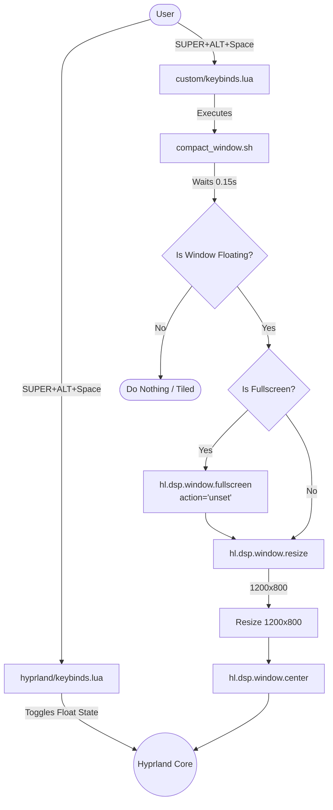

# Illogical Impulse Dotfiles (end-4/dots-hyprland) - Customization Guide

## 🤖 Instructions for Future AI Agents
**READ THIS BEFORE MAKING ANY CHANGES TO THE HYPRLAND CONFIGURATION.**

### Context
The user is running the [end-4/dots-hyprland](https://github.com/end-4/dots-hyprland) dotfiles. These dotfiles use a highly customized and dynamic setup (relying on AGS and Lua-based configuration parsing). 

### The Problem
The user occasionally updates the main scripts or tests other dotfile scripts. During these processes, core Hyprland configurations—especially aesthetic ones like their preferred **frosted glass transparency** (instead of pure blur)—often get overwritten, destroying their carefully crafted "rice".

### Your Goal as an Agent
1. **Safety First**: NEVER modify the core upstream files in `~/.config/hypr/` outside of the `custom` directory unless explicitly requested.
2. **The `custom` Folder is the Safe Haven**: All user-specific changes MUST go into `~/.config/hypr/custom/`. The upstream dotfile system is designed to load overrides from this folder. Treating this folder as a "custom fork" on the user's disk ensures scripts won't wipe out their work.
3. **Persist the Rice**: Actively maintain the user's specific aesthetics (e.g., frosted glass opacity overrides, centered compact floating windows).
4. **Use Scripts for Complex Actions**: If a keybind requires logic, create a bash script in `~/.config/hypr/custom/scripts/` and bind the shortcut to execute that script in `keybinds.lua`.

---

## 🛡️ Restore Script
To protect the user's settings (like the frosted glass look in `rules.lua`), a backup is kept in `~/.config/hypr/custom_backup_safe/`.
If settings are lost, simply run `~/.config/hypr/custom/scripts/restore_settings.sh` to restore them.

---

## 🛑 Critical Technical Findings (Aug 7, 2026)
During the setup of a custom `compact_window.sh` script, several crucial architectural behaviors of this specific dotfile were discovered:

1. **Hyprland IPC Interception (`hl.dispatch`)**:
   The `end-4/dots-hyprland` configuration uses a Lua plugin (`hyprland-lua`) that **intercepts almost all standard Hyprctl dispatch commands over the IPC socket**. 
   - Commands like `hyprctl dispatch resizeactive exact 1200 800` will fail with Lua syntax errors (e.g., `')' expected near 'exact'`) because they are improperly parsed as `return hl.dispatch(resizeactive exact 1200 800)`.
   - **The Fix**: You MUST pass valid Lua dispatcher strings inside quotes when using `hyprctl dispatch`. 
     *Example:* `hyprctl dispatch "hl.dsp.window.resize({ x = 1200, y = 800, 'exact' })"`
     *Example:* `hyprctl dispatch "hl.dsp.window.fullscreen({ action = 'unset' })"`

## 🗺️ System Architecture & Workflow

Here is how the custom compact mode integrates with Hyprland:

## 📦 Current Custom Setup Summary
- **Compact Window Toggle**: `Super + Alt + Space` toggles any window between normal tiling and a centered compact float (`1200x800`).
- **No Auto-Floating on Open**: Windows open normally tiled by default.
- **Frosted Glass Transparency**: Preserved in `custom/rules.lua`.
- **Restore Script**: `~/.config/hypr/custom/scripts/restore_settings.sh` available for recovering custom configs.
