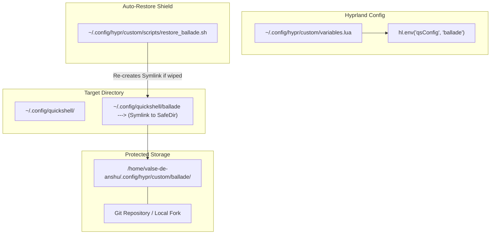

# 🌾 Rice Architecture Analysis: `ii` vs `end4-pC` & Safeguarding `ballade`

This document presents a complete comparative analysis of **`ii` (illogical-impulse)** and **`end4-pC`**, inspects the behavior of the `dots-hyprland` installer script (`setup`), and outlines a strategy for building your protected custom rice: **`ballade`**.

---

## 📑 Executive Summary

| Feature / Aspect | `ii` (illogical-impulse) | `end4-pC` | `ballade` (Proposed Custom Rice) |
| :--- | :--- | :--- | :--- |
| **Origin** | Official [end-4/dots-hyprland](https://github.com/end-4/dots-hyprland) | Custom fork by [pctrade/end4-pC](https://github.com/pctrade/end4-pC) | Your personal hybrid rice |
| **Top Bar** | Standard Material 3 expressive bar | Custom modular bar with weather & desktop menu | Hybrid: `end4-pC` bar + custom widgets |
| **Window Opacity** | Frosted glass blur effect | Fully transparent window background | Restored Frosted Glass (custom opacity) |
| **Extra Modules** | Standard overview, dock, sidebars | Desktop Menu, Dropover staging, Weather, Settings Overlay | Selected best features of both |
| **Installer Safety** | Target of `./setup` script | At risk of `rsync --delete` wipe | **100% Protected** via safe storage strategy |

---

## 🔍 Part 1: Detailed Comparison — `ii` vs `end4-pC`

### 1. Architectural Differences
- **`ii` (illogical-impulse)**:
  - Maintained as part of the core `dots-hyprland` repository.
  - QuickShell QML structure is divided into `modules/ii`, `modules/settings`, and `modules/waffle`.
  - Default environment configuration: `hl.env("qsConfig", "ii")` in Hyprland's `variables.lua`.

- **`end4-pC`**:
  - Independent fork of `ii` created by **pctrade**.
  - Adds dedicated modules inside `modules/ii/`:
    - `desktopMenu/`: Custom desktop menu widget.
    - `dropover/`: Temporary drag-and-drop file staging shelf.
    - `settings/`: Embedded QuickShell settings overlay (`SUPER + Escape`).
  - Uses custom weather API integration (via `gh0stzk`).

### 2. Top Bar & Window Transparency Behavior

#### Top Bar Differences
- `ii` uses the default upstream QuickShell top bar with standard workspace switchers, media pill, and system tray.
- `end4-pC` replaces this with a modified, highly customizable top bar layout that includes:
  - Weather status pill.
  - Interactive desktop launcher menu button.
  - Live media player controls with expandable lyrics.
  - Online wallpaper selector integration.

#### Frosted Glass vs Complete Transparency
- **`ii` Behavior**: Uses Hyprland blur rules coupled with semi-opaque window surface colors (`rgba(..., 0.7-0.85)`), creating a **frosted glass** aesthetic.
- **`end4-pC` Behavior**: Overrides window alpha channels and theme surface variables to `0.0` or full transparency (`rgba(..., 0.0)`), causing windows to appear strictly transparent without the dense frosted glass background.

---

## ⚠️ Part 2: Installer Script Inspection (`./setup`)

### 1. How the Script Overwrites Files
When running `./setup install` or `./setup install-files` in `dots-hyprland`, the installation process executes [3.files-legacy.sh](file:///home/valse-de-anshu/Desktop/git%20hyprland%20dots/dots-hyprland/sdata/subcmd-install/3.files-legacy.sh):

```bash
# sdata/subcmd-install/3.files-legacy.sh (Lines 22-28)
case "${SKIP_QUICKSHELL}" in
  true) true;;
  *)
    # Overwriting the whole directory!
    install_dir__sync dots/.config/quickshell "$XDG_CONFIG_HOME"/quickshell
    ;;
esac
```

### 2. The Root Cause of Folder Wiping
`install_dir__sync` uses `rsync` with the `--delete` flag:

```bash
# sdata/subcmd-install/3.files-install.sh (Line 75)
rsync -a --delete "$1"/ "$2"/
```

- **What `rsync -a --delete` does**: It forces the destination directory (`~/.config/quickshell/`) to match the repository source (`dots/.config/quickshell/`) **EXACTLY**.
- **The Consequence**: Any subfolder inside `~/.config/quickshell/` that does **NOT** exist in `dots-hyprland` repository (such as `end4-pC`, `ballade`, or any custom folder) is automatically **DELETED / WIPED OUT** every time you run `./setup`!

### 3. What is Safe vs What is Not Safe

> [!CAUTION]
> **NOT SAFE**: Placing custom folders directly inside `~/.config/quickshell/` (e.g., `~/.config/quickshell/ballade`). The legacy setup script WILL delete it upon running `./setup`.

> [!IMPORTANT]
> **SAFE**: Placing files inside `~/.config/hypr/custom/`. 
> Line 75 of `3.files-legacy.sh` explicitly protects this folder:
> ```bash
> install_dir__ignore_existing "dots/.config/hypr/custom" "${XDG_CONFIG_HOME}/hypr/custom"
> ```
> Upstream scripts will **NEVER** wipe contents in `~/.config/hypr/custom/`.

---

## 🛠️ Part 3: Architecture Strategy for `ballade`

To create your own custom rice named **`ballade`** combining `ii` and `end4-pC` while ensuring it is **100% immune** to script updates, follow this strategy:



### 1. Bulletproof Storage Location
1. Store the master source code of `ballade` in **`~/.config/hypr/custom/ballade/`** (or a standalone repository like `~/ballade/`).
2. Create a symlink from `~/.config/quickshell/ballade` pointing to `~/.config/hypr/custom/ballade`.
3. If `./setup` runs and deletes `~/.config/quickshell/ballade`, your source code remains completely untouched in `custom/ballade`.
4. A 1-line restore script (`restore_ballade.sh`) in `custom/scripts/` will instantly recreate the symlink.

### 2. How to Load `ballade` in Hyprland
In `~/.config/hypr/custom/variables.lua` (which is protected from updates):

```lua
-- Force QuickShell to load your custom 'ballade' rice
hl.env("qsConfig", "ballade")
```

### 3. Mixing `end4-pC` Top Bar + Restoring Frosted Glass
To achieve your exact preferred aesthetics in `ballade`:

1. **Top Bar**: Copy `end4-pC/modules/ii/bar` into `ballade/modules/ii/bar` so you retain the customized top bar, weather, and widgets.
2. **Frosted Glass Restoration**:
   - In `~/.config/hypr/custom/rules.lua`, enforce window blur and transparency rules:
     ```lua
     -- Restore Frosted Glass Opacity
     hl.option("decoration:blur:enabled", "true")
     hl.option("decoration:blur:size", "8")
     hl.option("decoration:blur:passes", "3")
     hl.option("decoration:active_opacity", "0.90")
     hl.option("decoration:inactive_opacity", "0.80")
     ```
   - In `ballade/GlobalStates.qml` or theme definition, ensure background color channels use semi-opaque alphas (`0.75-0.85`) instead of `0.0`.

---

## 📋 Recommended Action Plan for `ballade` Creation

1. **Initialize `ballade` Repository**:
   - Copy `~/.config/quickshell/end4-pC` to `~/.config/hypr/custom/ballade`.
   - Initialize git inside `~/.config/hypr/custom/ballade` so all your edits are version-controlled.

2. **Create Symlink**:
   ```bash
   ln -sfn ~/.config/hypr/custom/ballade ~/.config/quickshell/ballade
   ```

3. **Configure Hyprland**:
   - Set `hl.env("qsConfig", "ballade")` in `~/.config/hypr/custom/variables.lua`.

4. **Create Self-Healing Script**:
   - Add `restore_ballade.sh` to `~/.config/hypr/custom/scripts/` to ensure symlinks are auto-restored after upstream `dots-hyprland` updates.
